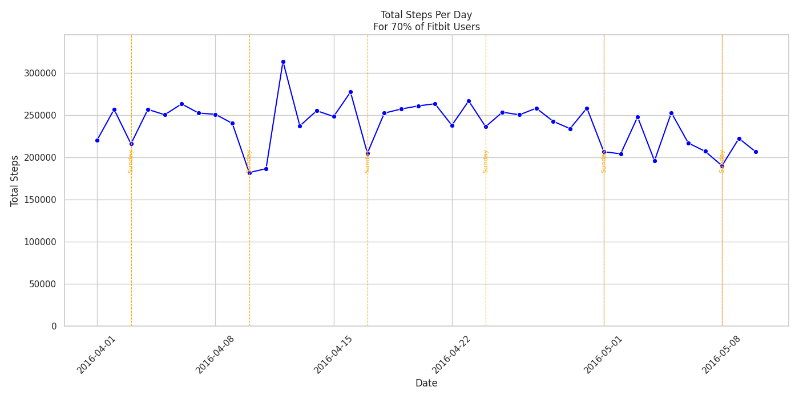

# Chapter 4: Analysis phase (Fitbit)

Now that the Fitbit dataset is cleaned and stored in the `Cleaned_Fitbit` folder, it's time to start the actual data analysis.

## 1) Reminder of the business task

To stay aligned with the business task, I need to keep in mind the following key questions:
   
- What are some trends in smart device usage?
- How could these trends apply to Bellabeat customers?
- How could these trends help influence Bellabeat marketing strategy?

## 2) Reminder of the 18 files

The Fitbit dataset contains the following 18 files:

* `combined_dailyActivity_merged.csv`
* `combined_heartrate_seconds_merged.csv`
* `combined_hourlyCalories_merged.csv`
* `combined_hourlyIntensities_merged.csv`
* `combined_hourlySteps_merged.csv`
* `combined_minuteCaloriesNarrow_merged.csv`
* `combined_minuteIntensitiesNarrow_merged.csv`
* `combined_minuteMETsNarrow_merged.csv`
* `combined_minuteSleep_merged.csv`
* `combined_minuteStepsNarrow_merged.csv`
* `combined_weightLogInfo_merged.csv`
* `dailyCalories_merged.csv`
* `dailyIntensities_merged.csv`
* `dailySteps_merged.csv`
* `minuteCaloriesWide_merged.csv`
* `minuteIntensitiesWide_merged.csv`
* `minuteStepsWide_merged.csv`
* `sleepDay_merged.csv`


## 2) Approach to the analysis

After reviewing the tibbles, structures, summaries, and column names of the 18 files in the Process phase, I identified several potential trends:

- Activity trends: when users are most active (morning, afternoon, evening), which day of the week, or is it more on weekends.
- Intensity trends: when users' activity is more or less intense.
- Sleep patterns: is there any correlation between activity levels and sleep duration.
- Heart rate patterns: is there any correlation between activity levels and heart rate changes.

I uploaded the 18 files to BigQuery to run SQL queries for further exploration. Although I could conduct the entire analysis in R, I felt more comfortable using SQL first to filter and summarize data. Then I used a Python notebook for quick visualizations in BigQuery, and at last I exported the results as .csv files for detailed analysis and plotting in R.


## 3) First steps in BigQuery

### Creating a dataset

After accessing BigQuery, I selected my working project (`alien-oarlock-428016-f3`) in the left-hand navigation panel.
On the right of the project name, I clicked on the 3 dots and select `Create dataset`.
In the dialog box that appeared, I typed `bellabeat` in the `Dataset ID`, chose `Multi-region EU` for the `Location`, left the other settings at their default values, and then clicked `Create Dataset`.

### Creating tables

Once my dataset bellabeat was created, right on the dataset name, I clicked the three dots again and selected `Create table`. I began uploading the CSV files from my local `Cleaned_Fitbit` folder to BigQuery, one file at a time. The uploads for the daily activity, daily steps, and daily intensity files went smoothly. However, I encountered an error for the heart rate file (exceeded 100MB). 

### Handling large files with Google Cloud Storage (GCS)

Because the heart rate file was too big (over 100MB), I could not upload it directly to BigQuery. Instead, I used Google Cloud Storage (GCS) to handle the file. Since GCS is part of the same platform as BigQuery, it’s very convenient.

I navigated to Cloud Storage from the left-hand Explorer pane, then clicked `CREATE BUCKET`. After making sure I was in the correct project (check the drop-down at the top of the screen), I named my bucket `bellabeat-proj`.

I selected `Multi-region EU` for the `Location` and kept the other settings as defaults before clicking `Create`.

With my bucket `bellabeat-proj` created, I uploaded the heart rate .csv file by selecting UPLOAD / Upload files on my bucket page.

Finally, I went back to BigQuery Studio. From the left-hand Explorer pane, I navigated to my project and dataset, clicked on the three dots, and selected `Create table`. I was able to browse to my bucket in Google Cloud Studio and import the heart rate file as a new table named `heartrate`.


## 4) Data analysis using SQL (with Python and R for visualization)

With the CSV files uploaded as tables in BigQuery, I begin the analysis using SQL queries.

### Verifying data integrity (date range and Fitbit user count)

To check if the number of unique users matches expectations, I ran the following query:

``` sql
SELECT 
    COUNT(DISTINCT Id) AS UniqueUserCount
FROM 
    `alien-oarlock-428016-f3.bellabeat.daily_activity`;
```

Output
```
Row 	UniqueUserCount
	
1 	   35
```

The count shows 35 users instead of the expected 30, which is acceptable.

Next, I verified that the date range matches the dataset's intended timeframe (March 12, 2016, to May 12, 2016):

``` sql

SELECT 
    Id,
    MIN(ActivityDate) AS MinDate,
    MAX(ActivityDate) AS MaxDate
FROM 
    `alien-oarlock-428016-f3.bellabeat.daily_activity`
```

Output:

```
Row 	   MinDate          MaxDate
	
1 	      2016-03-12       2016-05-12

```

The dataset covers the expected period, so data integrity is confirmed, at least on that aspect.


### Total steps per day (for at least 70% of Fitbit users)

To explore user activity, I calculated the total steps per day for the days where at least 70% of users reported their activity using SQL and a Python notebook.

SQL query:

```
SELECT 
    ActivityDate, 
    COUNT(DISTINCT Id) AS UserCount,
    ROUND(SUM(TotalSteps), 2) as TotalSteps,
    ROUND(SUM(TotalDistance), 2) as TotalDistance,
    ROUND(SUM(TrackerDistance), 2) as TrackerDistance
FROM 
    `alien-oarlock-428016-f3.bellabeat.daily_activity`
GROUP BY 
    ActivityDate
HAVING 
    UserCount >= 0.70 * 35  -- Representing at least 70% users
ORDER BY 
    ActivityDate;
```

Python code for plotting:

``` python
import pandas as pd
import matplotlib.pyplot as plt
import seaborn as sns
from google.cloud import bigquery

# Initialize BigQuery client
client = bigquery.Client()

# SQL query based on your specifications
query = """
SELECT 
    ActivityDate, 
    COUNT(DISTINCT Id) AS UserCount,
    ROUND(SUM(TotalSteps), 2) as TotalSteps,
    ROUND(SUM(TotalDistance), 2) as TotalDistance,
    ROUND(SUM(TrackerDistance), 2) as TrackerDistance
FROM 
    `alien-oarlock-428016-f3.bellabeat.daily_activity`
GROUP BY 
    ActivityDate
HAVING 
    UserCount >= 0.70 * 35  -- Representing at least 70% users
ORDER BY 
    ActivityDate;
"""

# Run the query and load the results into a DataFrame
query_job = client.query(query)
df = query_job.to_dataframe()

# Convert ActivityDate to a datetime object for plotting
df['ActivityDate'] = pd.to_datetime(df['ActivityDate'])

# Set up the plot style
sns.set(style="whitegrid")

# Set up the plot
plt.figure(figsize=(14, 7))
sns.lineplot(data=df, x='ActivityDate', y='TotalSteps', marker='o', color='blue')

# Highlight Sundays for better clarity
sundays = df[df['ActivityDate'].dt.dayofweek == 6]['ActivityDate']
for sunday in sundays:
    plt.axvline(x=sunday, color='orange', linestyle='--', linewidth=0.8)
    plt.text(sunday, df['TotalSteps'].min(), 'Sunday', rotation=90, color='orange', fontsize=8, va='bottom', ha='center')

# Customize the plot
plt.title('Total Steps Per Day\nFor 70% of Fitbit Users')
plt.xlabel('Date')
plt.ylabel('Total Steps')
plt.xticks(rotation=45)
plt.ylim(0, df['TotalSteps'].max() * 1.1)

plt.tight_layout()

# Save the plot
plt.savefig("Fitbit_total_steps_over_time_70_percent.png")
plt.show()

```

Output:



The plot shows that Fitbit sample users walk pretty regularly every day. Sundays are a bit slower, especially  compared to each previous Saturdays.

 

### Average steps per day (for at least 70% of Fitbit users)

To explore user activity, I calculated the average steps per day for the days where at least 70% of users reported their activity using SQL and a Python notebook.

SQL query:

```
SELECT 
    ActivityDate, 
    COUNT(DISTINCT Id) AS UserCount,
    ROUND(AVG(TotalSteps), 2) as AvgSteps,
    ROUND(AVG(TotalDistance), 2) as AvgDistance,
    ROUND(AVG(TrackerDistance), 2) as AvgTrackerDistance
FROM 
    `alien-oarlock-428016-f3.bellabeat.daily_activity`
GROUP BY 
    ActivityDate
HAVING 
    UserCount >= 0.70 * 35  -- Representing at least 70% users
ORDER BY 
    ActivityDate;

```

Python code for plotting:
``` python
import pandas as pd
import matplotlib.pyplot as plt
import seaborn as sns
from google.cloud import bigquery

# Initialize BigQuery client
client = bigquery.Client()

# SQL query based on your specifications
query = """
SELECT 
    ActivityDate, 
    COUNT(DISTINCT Id) AS UserCount,
    ROUND(AVG(TotalSteps), 2) as AvgSteps,
    ROUND(AVG(TotalDistance), 2) as AvgDistance,
    ROUND(AVG(TrackerDistance), 2) as AvgTrackerDistance
FROM 
    `alien-oarlock-428016-f3.bellabeat.daily_activity`
GROUP BY 
    ActivityDate
HAVING 
    UserCount >= 0.70 * 35  -- Representing at least 70% users
ORDER BY 
    ActivityDate;
"""

# Run the query and load the results into a DataFrame
query_job = client.query(query)
df = query_job.to_dataframe()

# Convert ActivityDate to a datetime object for plotting
df['ActivityDate'] = pd.to_datetime(df['ActivityDate'])

# Set up the plot style
sns.set(style="whitegrid")

# Set up the plot
plt.figure(figsize=(14, 7))
sns.lineplot(data=df, x='ActivityDate', y='AvgSteps', marker='o', color='blue')

# Highlight Sundays for better clarity
sundays = df[df['ActivityDate'].dt.dayofweek == 6]['ActivityDate']
for sunday in sundays:
    plt.axvline(x=sunday, color='orange', linestyle='--', linewidth=0.8)
    plt.text(sunday, df['AvgSteps'].min(), 'Sunday', rotation=90, color='orange', fontsize=8, va='bottom', ha='center')

# Customize the plot
plt.title('Average Steps Per Day\nFor 70% of Fitbit Users')
plt.xlabel('Date')
plt.ylabel('Average Steps')
plt.xticks(rotation=45)
plt.ylim(0, df['AvgSteps'].max() * 1.1)

plt.tight_layout()

# Save the plot
plt.savefig("Fitbit_average_steps_over_time_70_percent.png")
plt.show()
```

Output:

The plot shows that Fitbit sample users exhibit consistent walking patterns each day, with Sundays being slightly less active compared to Saturdays.
The average daily steps are around 7000, which seems to be a bit slow for Fitbit users.


### Distribution of average steps among users

Let's check the distribution of average steps among all users. It might help identify if there are outliers (users with very low or high step counts) that might skew the overall average. Let's run a SQL query to calculate the average steps per user across the period and then visualize the distribution in Python or R. 

SQL query
``` sql
SELECT 
    Id,
    ROUND(AVG(TotalSteps), 2) AS AvgStepsPerUser
FROM 
    `alien-oarlock-428016-f3.bellabeat.daily_activity`
GROUP BY 
    Id
ORDER BY 
    AvgStepsPerUser;

```

Python code:
``` python
import pandas as pd
import matplotlib.pyplot as plt
import seaborn as sns
from google.cloud import bigquery

# Initialize BigQuery client
client = bigquery.Client()

# SQL query to calculate average steps per user
query = """
SELECT 
    Id,
    ROUND(AVG(TotalSteps), 2) AS AvgStepsPerUser
FROM 
    `alien-oarlock-428016-f3.bellabeat.daily_activity`
GROUP BY 
    Id
ORDER BY 
    AvgStepsPerUser;
"""

# Run the query and load the results into a DataFrame
query_job = client.query(query)
df = query_job.to_dataframe()

# Set up the plot style
sns.set(style="whitegrid")

# Plot the distribution of average steps per user
plt.figure(figsize=(10, 6))
sns.histplot(df['AvgStepsPerUser'], bins=15, kde=True, color='blue')

# Customize the plot
plt.title('Distribution of Average Steps per User')
plt.xlabel('Average Steps Per Day')
plt.ylabel('Frequency')
plt.xlim(0, df['AvgStepsPerUser'].max() * 1.1)  # Start at 0 and extend slightly beyond the max value
plt.tight_layout()

# Save the plot
plt.savefig("Fitbit_average_steps_distribution.png")
plt.show()

```

The histogram shows that the majority of Fitbit users average around 7,500 steps per day, with a few outliers reaching up to 16,000 steps.


### Distribution of steps per day of the week

Let's check the distribution of average steps among the days of the week. Let's run a SQL query to calculate the average steps per user per day of the week and then visualize the distribution in Python or R. 

SQL query
``` sql
SELECT 
    EXTRACT(DAYOFWEEK FROM ActivityDate) AS DayOfWeek,
    ROUND(AVG(TotalSteps), 2) AS AvgSteps,
    COUNT(DISTINCT Id) AS UserCount
FROM 
    `alien-oarlock-428016-f3.bellabeat.daily_activity`
GROUP BY 
    DayOfWeek
HAVING 
    UserCount >= 0.7 * 35  -- For at least 70% Fitbit users logged in
ORDER BY 
    DayOfWeek;

```

Python code:
``` python

import pandas as pd
import matplotlib.pyplot as plt
import seaborn as sns
from google.cloud import bigquery

# Initialize BigQuery client
client = bigquery.Client()

# SQL query based on your specifications
query = """
SELECT 
    EXTRACT(DAYOFWEEK FROM ActivityDate) AS DayOfWeek,
    ROUND(AVG(TotalSteps), 2) AS AvgSteps,
    COUNT(DISTINCT Id) AS UserCount
FROM 
    `alien-oarlock-428016-f3.bellabeat.daily_activity`
GROUP BY 
    DayOfWeek
HAVING 
    UserCount >= 0.7 * 35
ORDER BY 
    DayOfWeek;
"""

# Run the query and load the results into a DataFrame
query_job = client.query(query)
df = query_job.to_dataframe()

# Map the day of the week to labels and reorder the days (starting from Monday)
day_labels = {1: 'Sunday', 2: 'Monday', 3: 'Tuesday', 4: 'Wednesday', 5: 'Thursday', 6: 'Friday', 7: 'Saturday'}
df['DayOfWeek'] = df['DayOfWeek'].map(day_labels)

# Reorder the DataFrame to start from Monday
day_order = ['Monday', 'Tuesday', 'Wednesday', 'Thursday', 'Friday', 'Saturday', 'Sunday']
df['DayOfWeek'] = pd.Categorical(df['DayOfWeek'], categories=day_order, ordered=True)
df = df.sort_values('DayOfWeek')

# Set up the plot style
sns.set(style="whitegrid")

# Plot the average steps per day of the week
plt.figure(figsize=(10, 6))
sns.barplot(x='DayOfWeek', y='AvgSteps', hue='DayOfWeek', data=df, palette='Blues_d', dodge=False, legend=False)

# Customize the plot
plt.title('Average Steps Per Day of the Week\n(For Days with >= 70% User Logging)')
plt.xlabel('Day of the Week')
plt.ylabel('Average Steps')
plt.xticks(rotation=45)
plt.tight_layout()

# Save and show the plot
plt.savefig("Average_Steps_Per_Day_of_Week.png")
plt.show()
```

The plot shows that step counts are fairly consistent throughout the week. This is coherent with previous plots where we saw that Fitbit users tend to walk regularly every day. Sundays have the lowest average step counts, while Saturdays have the highest average step counts.


### Daily steps versus time of the day (distinguishing weekdays and weekend)

I would like to see the change in step activity over time:


```sql
SELECT
  Id,
  DATE(TIMESTAMP(ActivityHour)) AS ActivityDate,  -- Extract the day
  CASE
    WHEN EXTRACT(HOUR FROM TIMESTAMP(ActivityHour)) BETWEEN 6 AND 11 THEN 'Morning'
    WHEN EXTRACT(HOUR FROM TIMESTAMP(ActivityHour)) BETWEEN 12 AND 17 THEN 'Afternoon'
    WHEN EXTRACT(HOUR FROM TIMESTAMP(ActivityHour)) BETWEEN 18 AND 23 THEN 'Evening'
    ELSE 'Night'
  END AS PeriodOfDay,
  SUM(StepTotal) AS TotalSteps
FROM
  `alien-oarlock-428016-f3.bellabeat.hourly_steps`
GROUP BY
  Id, ActivityDate, PeriodOfDay
ORDER BY
  Id, ActivityDate, PeriodOfDay;
```

After that, I exported the `BigQuery_daily_steps.csv` file to my local `BigQuery_Exports` folder.
Next, I analyzed the .csv file further in R and created a visualization.

Sample R code:
```R
# Goal: plot BigQuery dataframe (daily steps by time of the day, distinguishing weekdays and weekend)

# Define path to csv file
csv_file <- here("DATA", "Fitbit", "BigQuery_Exports", "BigQuery_daily_steps.csv")

fitbit_steps <- read_csv(csv_file)

# Inspect the data
glimpse(fitbit_steps)

# Make sure the columns are in the right format
fitbit_steps <- fitbit_steps %>%
  mutate(
    ActivityDate = as.Date(ActivityDate, format = "%Y-%m-%d"),  # Ensure the date is in Date format
    PeriodOfDay = factor(PeriodOfDay, levels = c("Morning", "Afternoon", "Evening", "Night"))  # Period order
  )

# Add a column is_weekend
fitbit_steps <- fitbit_steps %>%
  mutate(is_weekend = if_else(wday(ActivityDate, week_start = 1) %in% c(6, 7), "Weekend", "Weekday"))

# Inspect new column
glimpse(fitbit_steps)

ggplot(fitbit_steps, aes(x = PeriodOfDay, y = TotalSteps, fill = is_weekend)) +
  geom_bar(stat = "identity", position = "dodge") +
  labs(title = "Total Steps by Time of Day (Weekday vs Weekend)",
       x = "Period of Day",
       y = "Total Steps") +
  facet_wrap(~ is_weekend) +  # Facet by Weekend vs Weekday
  theme_minimal() +
  theme(
    axis.text.x = element_text(angle = 45, hjust = 1)  # Tilt x-axis labels for readability
  )

```


### Average intensity versus time of the day (distinguishing weekdays and weekend)

Again, I started by running an SQL query in BigQuery:

```sql
SELECT
  Id,
  DATE(TIMESTAMP(ActivityHour)) AS ActivityDate,  -- Extract the day
  CASE
    WHEN EXTRACT(HOUR FROM TIMESTAMP(ActivityHour)) BETWEEN 6 AND 11 THEN 'Morning'
    WHEN EXTRACT(HOUR FROM TIMESTAMP(ActivityHour)) BETWEEN 12 AND 17 THEN 'Afternoon'
    WHEN EXTRACT(HOUR FROM TIMESTAMP(ActivityHour)) BETWEEN 18 AND 23 THEN 'Evening'
    ELSE 'Night'
  END AS PeriodOfDay,
  ROUND(AVG(AverageIntensity), 2) AS Avg_Intensity_Period -- calculate the average per period
FROM
  `alien-oarlock-428016-f3.bellabeat.hourly_intensity`
GROUP BY
  Id, ActivityDate, PeriodOfDay
ORDER BY
  Id, ActivityDate, PeriodOfDay; 
```
After that, I exported the `BigQuery_daily_average_intensity.csv` file to my local `BigQuery_Exports` folder.
Next, I analyzed the .csv file further in R and created a visualization.

Sample R code:
```R
# Goal: plot BigQuery dataframe (average intensity by time of the day, distinguishing weekdays and weekend)

# Define path to csv file
csv_file <- here("DATA", "Fitbit", "BigQuery_Exports", "BigQuery_daily_average_intensity.csv")

fitbit_avg_intensity <- read_csv(csv_file)

# Inspect the data
glimpse(fitbit_avg_intensity)

# Make sure columns are in the right format
fitbit_avg_intensity <- fitbit_avg_intensity %>%
  mutate(
    ActivityDate = as.Date(ActivityDate, format = "%Y-%m-%d"),  # Make sure the date is in Date format
    PeriodOfDay = factor(PeriodOfDay, levels = c("Morning", "Afternoon", "Evening", "Night"))  # Period order
  )

# Add a column is_weekend
fitbit_avg_intensity <- fitbit_avg_intensity %>%
  mutate(is_weekend = if_else(wday(ActivityDate, week_start = 1) %in% c(6, 7), "Weekend", "Weekday"))

# Inspect new column
glimpse(fitbit_avg_intensity)

# Plot with facets weekdays/weekend
ggplot(fitbit_intensity, aes(x = PeriodOfDay, y = Sum_Average_Intensity, fill = is_weekend)) +
  geom_bar(stat = "identity", position = "dodge") +
  labs(title = "Average Intensity by Time of Day (Weekday vs Weekend)",
       x = "Period of Day",
       y = "Average Intensity") +
  facet_wrap(~ is_weekend) +  # Facet by Weekend vs Weekday
  theme_minimal() +
  theme(
    axis.text.x = element_text(angle = 45, hjust = 1)  # Tilt x-axis labels for readability
  )

```


### Sleep (sleep duration and time in bed) versus steps

I started by running an SQL query in BigQuery:

``` sql
SELECT 
    steps.Id, 
    steps.ActivityDay, 
    steps.StepTotal,  -- below: FLOOR() to extract hour, MOD() to extract minutes
    CONCAT(FLOOR(sleep.TotalMinutesAsleep / 60), "h ", MOD(sleep.TotalMinutesAsleep, 60), "min") AS TotalSleepDuration, 
    CONCAT(FLOOR(sleep.TotalTimeInBed / 60), "h ", MOD(sleep.TotalTimeInBed, 60), "min") AS TotalTimeInBedDuration, 
    ROUND((sleep.TotalMinutesAsleep / sleep.TotalTimeInBed) * 100, 2) AS SleepEfficiencyPercent
FROM 
    `alien-oarlock-428016-f3.bellabeat.daily_steps` AS steps
JOIN 
    `alien-oarlock-428016-f3.bellabeat.sleep_day` AS sleep
ON 
    steps.Id = sleep.Id  -- Join on the same user
AND 
    DATE(steps.ActivityDay) = DATE(sleep.SleepDay)  -- Join on the same day
ORDER BY 
    steps.Id, steps.ActivityDay;

```

After that, I exported the `BigQuery_sleep_versus_steps.csv` file to my local `BigQuery_Exports` folder.
Next, I analyzed the .csv file further in R and created a visualization.

Sample R code:
```R
# Goal: plot BigQuery dataframe (Sleep Duration versus Daily Steps)

# Define path to csv file
csv_file <- here("DATA", "Fitbit", "BigQuery_Exports", "BigQuery_sleep_versus_steps.csv")

fitbit_steps_sleep <- read_csv(csv_file)

# Inspect the data
glimpse(fitbit_steps_sleep)

# Convert 'TotalSleepDuration' from "Xh Ymin" format to total hours
fitbit_steps_sleep <- fitbit_steps_sleep %>%
  mutate(TotalSleepHours = as.numeric(gsub("h.*", "", TotalSleepDuration)) +  # Extract hours
           as.numeric(gsub(".*h |min", "", TotalSleepDuration)) / 60)          # Extract minutes and convert to hours

# Inspect the new column
glimpse(fitbit_steps_sleep)

# Create the plot to show relationship between steps and sleep (with 'TotalSleepHours' column to make it work)
ggplot(fitbit_steps_sleep, aes(x = StepTotal, y = TotalSleepHours)) +
  geom_point(aes(color = TotalSleepHours)) +  # Scatter plot with color based on 'TotalSleepHours'
  geom_smooth(method = "lm", se = FALSE, color = "red") +  # Add a trend line
  labs(title = "Relationship between Sleep Duration and Daily Steps",
       x = "Total Steps",
       y = "Sleep Duration (hours)") +
  theme_minimal() +
  theme(
    axis.text.x = element_text(angle = 45, hjust = 1)  # Tilt x-axis labels for readability
  )
```

### Very active minutes versus calories spent

SQL query in BigQuery:

``` sql
SELECT 
  Id, 
  ActivityDate, 
  SUM(VeryActiveMinutes) AS TotalVeryActiveMinutes, 
  SUM(Calories) AS TotalCalories
FROM 
  `alien-oarlock-428016-f3.bellabeat.daily_activity`
GROUP BY 
  Id, ActivityDate
ORDER BY 
  TotalVeryActiveMinutes DESC;

```

After that, I exported the `BigQuery_very_active_vs_calories.csv` file to my local `BigQuery_Exports` folder.
Next, I analyzed the .csv file further in R and created a visualization.

Sample R code:
```R
# Goal: Plot the relationship between Very Active Minutes and Calories burned

# Define path to the csv file
csv_file <- here("DATA", "Fitbit", "BigQuery_Exports", "BigQuery_very_active_vs_calories.csv")

# Load the CSV file
fitbit_active_vs_calories <- read_csv(csv_file)

# Inspect the data
glimpse(fitbit_active_vs_calories)

# Ensure ActivityDate is in Date format
fitbit_active_vs_calories <- fitbit_active_vs_calories %>%
  mutate(ActivityDate = as.Date(ActivityDate, format = "%Y-%m-%d"))

# Inspect the data
glimpse(fitbit_active_vs_calories)

# Create the plot to show the relationship between Very Active Minutes and Calories
ggplot(fitbit_active_vs_calories, aes(x = TotalVeryActiveMinutes, y = TotalCalories)) +
  geom_point(aes(color = TotalCalories)) +
  geom_smooth(method = "lm", se = FALSE, color = "red") +
  labs(title = "Very Active Minutes vs Calories Burned", x = "Very Active Minutes", y = "Calories") +
  theme_minimal() +
  theme(axis.text.x = element_text(angle = 45, hjust = 1))

```


### Heart rate versus steps

First I ran an SQL query in BigQuery:

``` sql
-- Calculates the average heart rate (AVG(Value)) for each user (Id) per day (ActivityDay).
WITH avg_heart_rate AS (   

   SELECT 
   Id,
   DATE(TIMESTAMP(Time)) as ActivityDay,  -- get only the day from TIMESTAMP
   avg(Value) as AvgHeartRate  -- Calculate average heart rate per day
   
   FROM 
      `alien-oarlock-428016-f3.bellabeat.heartrate`
   GROUP BY 
      Id, ActivityDay
)


SELECT

steps.Id,
steps.StepTotal,
ROUND(avg_heart_rate.AvgHeartRate, 1) as AverageHeartRate

FROM `alien-oarlock-428016-f3.bellabeat.daily_steps` as steps
JOIN avg_heart_rate

ON 
  steps.Id = avg_heart_rate.Id
AND 
  steps.ActivityDay = avg_heart_rate.ActivityDay

ORDER BY 
  steps.Id, steps.ActivityDay ;
```
After that, I exported the `BigQuery_heartrate_versus_steps.csv` file to my local `BigQuery_Exports` folder.
Next, I analyzed the .csv file further in R and created a visualization.

## 5) Analyzing Activity Patterns Around Easter (March 24 - March 30, 2016)

To explore how users' activity levels changed during the Easter period in 2016 (Easter Sunday was March 27, 2016), I used BigQuery to run SQL queries on the `combined_dailyActivity_merged` dataset, which I renamed as the `daily_activity` table in BigQuery. 

### SQL query in BigQuery

The query below calculates the average steps, calories burned, and activity minutes for each day between March 24 and March 30, 2016:

```sql
SELECT 
    ActivityDate,
    AVG(TotalSteps) AS AvgSteps,
    AVG(Calories) AS AvgCalories,
    AVG(VeryActiveMinutes) AS AvgVeryActiveMinutes,
    AVG(FairlyActiveMinutes) AS AvgFairlyActiveMinutes,
    AVG(LightlyActiveMinutes) AS AvgLightlyActiveMinutes,
    AVG(SedentaryMinutes) AS AvgSedentaryMinutes
FROM 
    `alien-oarlock-428016-f3.bellabeat.daily_activity`
WHERE 
    ActivityDate BETWEEN DATE("2016-03-24") AND DATE("2016-03-30")
GROUP BY 
    ActivityDate
ORDER BY 
    ActivityDate;
```

### Data visualization in Python

To visualize the data directly in BigQuery Studio, I used Python to create separate line plots for each metric, marking Easter Sunday (March 27):

``` python
import pandas as pd
import matplotlib.pyplot as plt
import seaborn as sns

# Convert the date string to a datetime object
easter_sunday = pd.to_datetime('2016-03-27')

# Set up a grid for multiple subplots
fig, axes = plt.subplots(2, 2, figsize=(14, 10), sharex=True)

# Plot 1: Average Steps
sns.lineplot(ax=axes[0, 0], x='ActivityDate', y='AvgSteps', data=df, marker='o', color='blue')
axes[0, 0].axvline(x=easter_sunday, color='black', linestyle='--', label='Easter Sunday')
axes[0, 0].set_title('Average Steps')
axes[0, 0].set_ylabel('Steps')

# Plot 2: Average Calories
sns.lineplot(ax=axes[0, 1], x='ActivityDate', y='AvgCalories', data=df, marker='o', color='green')
axes[0, 1].axvline(x=easter_sunday, color='black', linestyle='--', label='Easter Sunday')
axes[0, 1].set_title('Average Calories')
axes[0, 1].set_ylabel('Calories')

# Plot 3: Average Very Active Minutes
sns.lineplot(ax=axes[1, 0], x='ActivityDate', y='AvgVeryActiveMinutes', data=df, marker='o', color='red')
axes[1, 0].axvline(x=easter_sunday, color='black', linestyle='--', label='Easter Sunday')
axes[1, 0].set_title('Average Very Active Minutes')
axes[1, 0].set_ylabel('Minutes')

# Plot 4: Average Sedentary Minutes
sns.lineplot(ax=axes[1, 1], x='ActivityDate', y='AvgSedentaryMinutes', data=df, marker='o', color='purple')
axes[1, 1].axvline(x=easter_sunday, color='black', linestyle='--', label='Easter Sunday')
axes[1, 1].set_title('Average Sedentary Minutes')
axes[1, 1].set_ylabel('Minutes')

# Rotate x-axis labels for clarity and add legend
for ax in axes.flat:
    ax.set_xlabel('Date')
    ax.tick_params(axis='x', rotation=45)
    ax.legend()

plt.tight_layout()
plt.show()
```

### Findings

From the analysis, I noticed a gradual increase in steps from Good Friday (March 25) leading up to Easter Sunday (March 27). This pattern indicates that users might be more active around Easter holidays, possibly engaging in outdoor or family activities.


### Exporting the CSV file for further analysis and visualization using R

I exported the cleaned dataset as a CSV file (`around_easter.csv`) to further analyze and visualize the data using R. 
Sample code in R:

``` r
# Read the CSV file into R
easter_activity <- read_csv("path_to_your_file/easter_activity_data.csv")

# Plot the steps around Easter
ggplot(easter_activity, aes(x = ActivityDate, y = AvgSteps)) +
  geom_line() +
  geom_vline(xintercept = as.Date("2016-03-27"), linetype = "dashed", color = "red", size = 0.5) +
  labs(title = "Average Steps Around Easter (March 24 - 30, 2016)",
       x = "Date",
       y = "Average Steps") +
  theme_minimal()
```


