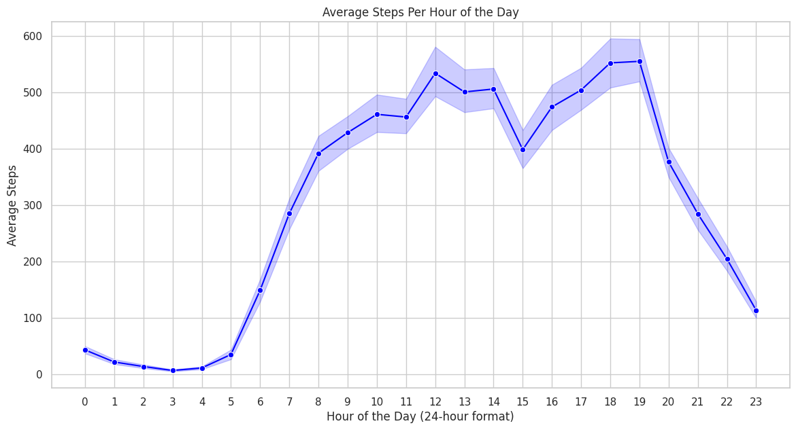

# Chapter 4: Analysis (Fitbit)

Now that the Fitbit dataset is cleaned and stored in the `Cleaned_Fitbit` folder, it's time to start the actual data analysis.


## 1) Recap of the 18 files

The `Cleaned_Fitbit` folder contains the following 18 files:

* `cleaned_combined_dailyActivity_merged.csv`
* `cleaned_combined_heartrate_seconds_merged.csv`
* `cleaned_combined_hourlyCalories_merged.csv`
* `cleaned_combined_hourlyIntensities_merged.csv`
* `cleaned_combined_hourlySteps_merged.csv`
* `cleaned_combined_minuteCaloriesNarrow_merged.csv`
* `cleaned_combined_minuteIntensitiesNarrow_merged.csv`
* `cleaned_combined_minuteMETsNarrow_merged.csv`
* `cleaned_combined_minuteSleep_merged.csv`
* `cleaned_combined_minuteStepsNarrow_merged.csv`
* `cleaned_combined_weightLogInfo_merged.csv`
* `cleaned_dailyCalories_merged.csv`
* `cleaned_dailyIntensities_merged.csv`
* `cleaned_dailySteps_merged.csv`
* `cleaned_minuteCaloriesWide_merged.csv`
* `cleaned_minuteIntensitiesWide_merged.csv`
* `cleaned_minuteStepsWide_merged.csv`
* `cleaned_sleepDay_merged.csv`


## 2) Approach to the analysis

As I saw in R in the Process phase, several trends seem to emerge:

- Activity trends: when users are more or less active (ex. `ActivityDate` and `ActivityHour`) in terms of steps or distance.
- Intensity trends: variations in activity levels (ex. `VeryActiveMinutes`, `FairlyActiveMinutes`, etc.).
- Sleep trends: sleep patterns (ex. `TotalMinutesAsleep` and `TotalTimeInBed`).
- Calories trends: calories spent seem to be recorded daily, hourly, and even by the minute.
- Heart rate trends: heart rate (`Value`) recorded every 5 seconds.


For further exploration, I uploaded the .csv files to BigQuery to run SQL queries. Although I could conduct the entire analysis in R, I feel more comfortable using SQL queries first. Also in BigQuery I could use a Python notebook for quick visualizations of my SQL query results, which is very handy since it is in the same platform.


## 3) First steps in BigQuery

### Creating a dataset

After accessing BigQuery, I selected my working project (`alien-oarlock-428016-f3`) in the left-hand navigation panel.
On the right of the project name, I clicked on the 3 dots and select `Create dataset`.
In the dialog box that appeared, I typed `bellabeat` in the `Dataset ID`, chose `Multi-region EU` for the `Location`, left the other settings at their default values, and then clicked `Create Dataset`.

### Creating tables

Once my dataset bellabeat was created, right on the dataset name, I clicked the three dots again and selected `Create table`. I began uploading the CSV files from my local `Cleaned_Fitbit` folder to BigQuery, one file at a time. The uploads for the daily activity, daily steps, and daily intensity files went smoothly. However, I encountered an error for the heart rate file (exceeded 100MB). 

### Handling large files with Google Cloud Storage (GCS)

Because the heart rate file was too big (over 100MB), I could not upload it directly to BigQuery. Instead, I used Google Cloud Storage (GCS) to handle the file. Since GCS is part of the same platform as BigQuery, it’s very convenient.

I navigated to Cloud Storage from the left-hand Explorer pane, then clicked `CREATE BUCKET`. After making sure I was in the correct project (check the drop-down at the top of the screen), I named my bucket `bellabeat-proj`.

I selected `Multi-region EU` for the `Location` and kept the other settings as defaults before clicking `Create`.

With my bucket `bellabeat-proj` created, I uploaded the heart rate .csv file by selecting UPLOAD / Upload files on my bucket page.

Finally, I went back to BigQuery Studio. From the left-hand Explorer pane, I navigated to my project and dataset, clicked on the three dots, and selected `Create table`. I was able to browse to my bucket in Google Cloud Studio and import the heart rate file as a new table named `heartrate`.


## 4) Data analysis in BigQuery using SQL (and Python, Google Sheets and/or R for visualization)

With the CSV files uploaded as tables in BigQuery, I began the analysis by running SQL queries.
Based on my initial review of the 18 CSV files in R, the `cleaned_combined_dailyActivity_merged.csv` file appears to be the most complete and comprehensive. This file was uploaded as the `daily_activity` table in BigQuery. So let me start running queries on the `daily_activity` table.

### a) Verifying data integrity (Fitbit user count and date range)

- Fitbit user count: let's check if the number of unique users matches expectations with SQL.

SQL query:

``` sql
SELECT 
    COUNT(DISTINCT Id) AS UniqueUserCount
FROM 
    `alien-oarlock-428016-f3.bellabeat.daily_activity`;
```

Output
```
Row 	UniqueUserCount
	
1 	   35
```

Results: the count shows 35 users instead of the expected 30, which is acceptable. 


- Date range: let's verify if the date range matches the Fitbit dataset's intended timeframe (March 12, 2016, to May 12, 2016).

SQL query:

``` sql

SELECT 
    Id,
    MIN(ActivityDate) AS MinDate,
    MAX(ActivityDate) AS MaxDate
FROM 
    `alien-oarlock-428016-f3.bellabeat.daily_activity`
```

Output:

```
Row 	   MinDate          MaxDate
	
1 	      2016-03-12       2016-05-12

```

Results: the `daily_activity` table covers the expected period, so data integrity is confirmed, at least on this table.


### b) Summary statistics

Before plotting, let's first gather some general statistics for steps, distance, and tracker distance across the days where at least 70% of users reported their activity. This analysis will give an overall view of daily step trends and distance patterns among Fitbit users.

SQL query:

``` sql
SELECT 
    ROUND(AVG(TotalSteps), 2) AS OverallAvgSteps,
    ROUND(STDDEV(TotalSteps), 2) AS StdDevSteps,
    ROUND(AVG(TotalDistance), 2) AS OverallAvgDistance,
    ROUND(STDDEV(TotalDistance), 2) AS StdDevDistance,
    ROUND(AVG(TrackerDistance), 2) AS OverallAvgTrackerDistance,
    ROUND(STDDEV(TrackerDistance), 2) AS StdDevTrackerDistance
FROM 
    `alien-oarlock-428016-f3.bellabeat.daily_activity`
HAVING 
    COUNT(DISTINCT Id) >= 0.70 * 35;  -- Representing at least 70% users

``` 

Results:

``` 
OverallAvgSteps	| StdDevSteps | OverallAvgDistance | StdDevDistance | OverallAvgTrackerDistance | StdDevTrackerDistance
7281	        5214	    5.22	            3.99	        5.19	                    3.98
```

These summary statistics show that the average Fitbit user logs about 7,300 steps per day, with a standard deviation of 5,214, meaning there's quite some variation. Similarly, users walk an average of 5.22 km daily, with also a wide variation (3.99 km) across day. Their tracker distance tends to be close to that at 5.19 km.
It is important to note that I **assume** the distance unit is in km because it makes more sense with the values found here, but in real life I would check immediately with the person responsible for the Fitbit data source.


### c) Average steps per day

For plotting, I will focus on the step counts and ignore distance columns. Why? Because, first, the distance units are not provided. And second, I don't want to plot two different things (step counts and distance) on the same Y axis, for the sake of clarity.

SQL query:

``` sql
SELECT 
    ActivityDate, 
    COUNT(DISTINCT Id) AS UserCount,
    ROUND(AVG(TotalSteps), 2) as AvgSteps
FROM 
    `alien-oarlock-428016-f3.bellabeat.daily_activity`
GROUP BY 
    ActivityDate
HAVING 
    UserCount >= 0.70 * 35  -- Representing at least 70% users
ORDER BY 
    ActivityDate;

```

Python code:

``` python
import pandas as pd
import matplotlib.pyplot as plt
import seaborn as sns
from google.cloud import bigquery

# Initialize BigQuery client
client = bigquery.Client()

# SQL query 
query = """
SELECT 
    ActivityDate, 
    COUNT(DISTINCT Id) AS UserCount,
    ROUND(AVG(TotalSteps), 2) as AvgSteps
FROM 
    `alien-oarlock-428016-f3.bellabeat.daily_activity`
GROUP BY 
    ActivityDate
HAVING 
    UserCount >= 0.70 * 35  -- Representing at least 70% users
ORDER BY 
    ActivityDate;
"""

# Run query and load results into a dataframe
query_job = client.query(query)
df = query_job.to_dataframe()

# Convert ActivityDate to a datetime object for plotting
df['ActivityDate'] = pd.to_datetime(df['ActivityDate'])

# Set up plot style
sns.set(style="whitegrid")

# Set up plot
plt.figure(figsize=(14, 7))
sns.lineplot(data=df, x='ActivityDate', y='AvgSteps', marker='o', color='blue')

# Highlight Sundays for clarity
sundays = df[df['ActivityDate'].dt.dayofweek == 6]['ActivityDate']
for sunday in sundays:
    plt.axvline(x=sunday, color='orange', linestyle='--', linewidth=0.8)
    plt.text(sunday, df['AvgSteps'].min(), 'Sunday', rotation=90, color='orange', fontsize=8, va='bottom', ha='center')

# Customize plot
plt.title('Average Steps Per Day')
plt.xlabel('Date')
plt.ylabel('Average Steps')
plt.xticks(rotation=45)
plt.ylim(0, df['AvgSteps'].max() * 1.1)

plt.tight_layout()

# Save plot
plt.savefig("Fitbit_average_steps_per_day_70_percent.png")
plt.show()
```

Output:


The plot shows that Fitbit sample users walk pretty regularly every day. Sundays are the slowest days, while Mondays, Wednesdays, and Saturdays show a peak.

Since I have in mind my business task and the final Google Sheets presentation that I will show to the stakeholders, and since I know the main stakeholders are primarily the COO who has an artistic background as well as Bellabeat marketing team who want clear, actionable charts, I want to complement the analysis with nicer visualizations. So I exported the SQL results into Google Sheets for additional visualizations. Here's the same data plotted in Google Sheets:


### d) Distribution of steps among users

Let's check the distribution of average steps among users. It might help identify if there are outliers that might skew the overall average.


SQL query:

``` sql
SELECT 
    Id,
    CAST(ROUND(AVG(TotalSteps), 0) as INT) AS AvgStepsPerUser
FROM 
    `alien-oarlock-428016-f3.bellabeat.daily_activity`
GROUP BY 
    Id
ORDER BY 
    AvgStepsPerUser DESC;

```

Python code:

``` python
import pandas as pd
import matplotlib.pyplot as plt
import seaborn as sns
from google.cloud import bigquery

# Initialize BigQuery client
client = bigquery.Client()

# SQL query to calculate average steps per user
query = """
SELECT 
    Id,
    CAST(ROUND(AVG(TotalSteps), 0) as INT) AS AvgStepsPerUser
FROM 
    `alien-oarlock-428016-f3.bellabeat.daily_activity`
GROUP BY 
    Id
ORDER BY 
    AvgStepsPerUser DESC;
"""

# Run query and load results into a dataframe
query_job = client.query(query)
df = query_job.to_dataframe()

# Set up plot style
sns.set(style="whitegrid")

# Plot the distribution of average steps per user
plt.figure(figsize=(10, 6))
sns.histplot(df['AvgStepsPerUser'], bins=15, kde=True, color='blue')

# Customize plot
plt.title('Distribution of Average Steps per User')
plt.xlabel('Average Steps Per Day')
plt.ylabel('Frequency')
plt.xlim(0, df['AvgStepsPerUser'].max() * 1.1)  # Start at 0 and extend slightly beyond the max value
plt.tight_layout()

# Save the plot
plt.savefig("Fitbit_average_steps_distribution.png")
plt.show()

```

Output:


The histogram shows: 

- median step count per user is roughly 7,300 steps/day (precisely 7,299 steps/day)
- average step count is roughly 7,000 steps/day (precisely 6,982 steps/day) 
- 16 users out of 34 (approx. 47%) walk fewer than 7,000 steps/day.
- 20 users out of 34 (approx. 59%) walk fewer than 7,500 steps/day.
- 28 users out of 34 (approx. 82%)  walk fewer than 10,000 steps/day.


Again, to complement the analysis, I exported the SQL results into Google Sheets for additional visualizations. Here's the same data plotted in Google Sheets:


The results are quite different because both histograms do not have the same bucket size.


### e) Average steps per day of the week

Let's check the distribution of average steps among the days of the week.

SQL query:

``` sql
SELECT 
    EXTRACT(DAYOFWEEK FROM ActivityDate) AS DayOfWeek,
    ROUND(AVG(TotalSteps), 2) AS AvgSteps,
    COUNT(DISTINCT Id) AS UserCount
FROM 
    `alien-oarlock-428016-f3.bellabeat.daily_activity`
GROUP BY 
    DayOfWeek
HAVING 
    UserCount >= 0.7 * 35  -- For at least 70% Fitbit users logged in
ORDER BY 
    DayOfWeek;

```

Python code:

``` python

import pandas as pd
import matplotlib.pyplot as plt
import seaborn as sns
from google.cloud import bigquery

# Initialize BigQuery client
client = bigquery.Client()

# SQL query based on your specifications
query = """
SELECT
    EXTRACT(DAYOFWEEK FROM ActivityDate) AS DayOfWeek,
    ROUND(AVG(TotalSteps), 2) AS AvgSteps,
    COUNT(DISTINCT Id) AS UserCount
FROM
    `alien-oarlock-428016-f3.bellabeat.daily_activity`
GROUP BY
    DayOfWeek
HAVING
    UserCount >= 0.7 * 35
ORDER BY
    DayOfWeek;
"""

# Run the query and load the results into a DataFrame
query_job = client.query(query)
df = query_job.to_dataframe()

# Map the day of the week to labels
day_labels = {1: 'Sunday', 2: 'Monday', 3: 'Tuesday', 4: 'Wednesday', 5: 'Thursday', 6: 'Friday', 7: 'Saturday'}
df['DayOfWeek'] = df['DayOfWeek'].map(day_labels)

# Reorder the DataFrame to start from Monday
day_order = ['Monday', 'Tuesday', 'Wednesday', 'Thursday', 'Friday', 'Saturday', 'Sunday']
df['DayOfWeek'] = pd.Categorical(df['DayOfWeek'], categories=day_order, ordered=True)
df = df.sort_values('DayOfWeek')

# Use the steps_dict to create a list of colors, where the intensity reflects the number of steps
max_steps = max(df['AvgSteps'])
min_steps = min(df['AvgSteps'])

# Normalize the steps between 0 and 1 for color intensity
normalized_steps = [(steps - min_steps) / (max_steps - min_steps) for steps in df['AvgSteps']]

# Define the color palette (lighter for lower steps, darker for higher steps)
colors = sns.light_palette("pink", as_cmap=False, n_colors=len(normalized_steps))

# Map normalized steps to the color palette
color_list = [colors[int(value * (len(colors) - 1))] for value in normalized_steps]

# Set up the figure and change the background color to violet
plt.figure(figsize=(10, 6))
ax = plt.gca()
ax.set_facecolor('violet')  # Set the background to violet

# Plot the average steps per day of the week using the color list for bar color
sns.barplot(x='DayOfWeek', y='AvgSteps', data=df, palette=color_list, dodge=False, legend=False)

# Customize the plot
plt.title('Average Steps Per Day of the Week')
plt.xlabel('Day of the Week')
plt.ylabel('Average Steps')
plt.xticks(rotation=45)
plt.tight_layout()

# Save and show the plot
plt.savefig("fitbit_average_steps_per_day_of_week.png")
plt.show()

```

Output:


The plot shows that step counts are fairly consistent throughout the week. This is coherent with previous plots where we saw that Fitbit users tend to walk regularly every day. Sundays have the lowest average step counts, while Mondays, Wednesdays and Saturdays have the highest average step counts.


Here are the same results using Google Sheets for plotting:


Again, the Google Sheet chart is more visually appealing and more clear. It was easy to add labels on Google Sheets, so I could add important information (how many average steps per day) on each day of the week on this graph. I am sure we can do the same thing in Python though (just need to learn it). 


### e) Average steps per time of the day

Let's see the average steps of each user per time of the day.

SQL query:

``` sql
WITH DailyUserCounts AS (
    SELECT
        DATE(TIMESTAMP(ActivityHour)) AS ActivityDate,
        COUNT(DISTINCT Id) AS TotalUsers
    FROM
        `alien-oarlock-428016-f3.bellabeat.hourly_steps`
    GROUP BY
        ActivityDate
)

SELECT
    EXTRACT(HOUR FROM TIMESTAMP(h.ActivityHour)) AS HourOfDay,
    CAST(ROUND(AVG(h.StepTotal),0) as INT) AS AverageStepsPerHour,
    DATE(TIMESTAMP(h.ActivityHour)) AS ActivityDate
FROM
    `alien-oarlock-428016-f3.bellabeat.hourly_steps` h
JOIN
    DailyUserCounts d
ON
    DATE(TIMESTAMP(h.ActivityHour)) = d.ActivityDate
GROUP BY
    HourOfDay, ActivityDate, d.TotalUsers
HAVING
    COUNT(DISTINCT h.Id) >= 0.7 * d.TotalUsers
ORDER BY
    HourOfDay;

```


Python code:
``` python

import pandas as pd
import matplotlib.pyplot as plt
import seaborn as sns
from google.cloud import bigquery

# Initialize BigQuery client
client = bigquery.Client()

# SQL query for average steps per hour of the day
query = """
WITH DailyUserCounts AS (
    SELECT
        DATE(TIMESTAMP(ActivityHour)) AS ActivityDate,
        COUNT(DISTINCT Id) AS TotalUsers
    FROM
        `alien-oarlock-428016-f3.bellabeat.hourly_steps`
    GROUP BY
        ActivityDate
)

SELECT
    EXTRACT(HOUR FROM TIMESTAMP(h.ActivityHour)) AS HourOfDay,
    CAST(ROUND(AVG(h.StepTotal),0) as INT) AS AverageStepsPerHour,
    DATE(TIMESTAMP(h.ActivityHour)) AS ActivityDate
FROM
    `alien-oarlock-428016-f3.bellabeat.hourly_steps` h
JOIN
    DailyUserCounts d
ON
    DATE(TIMESTAMP(h.ActivityHour)) = d.ActivityDate
GROUP BY
    HourOfDay, ActivityDate, d.TotalUsers
HAVING
    COUNT(DISTINCT h.Id) >= 0.7 * d.TotalUsers
ORDER BY
    HourOfDay;
"""

# Run query and load results into a DataFrame
query_job = client.query(query)
df = query_job.to_dataframe()

# Convert ActivityDate to datetime (optional, for further analysis)
df['ActivityDate'] = pd.to_datetime(df['ActivityDate'])

# Set up plot style
sns.set(style="whitegrid")

# Plotting the average steps per hour of the day
plt.figure(figsize=(14, 7))
sns.lineplot(data=df, x='HourOfDay', y='AverageStepsPerHour', marker='o', color='blue')

# Customize plot
plt.title('Average Steps Per Hour of the Day')
plt.xlabel('Hour of the Day (24-hour format)')
plt.ylabel('Average Steps')
plt.xticks(range(0, 24))
plt.grid(True)

# Save the plot as a PNG file
plt.savefig("Fitbit_average_steps_per_hour_of_the_day.png")

# Show the plot
plt.show()

```

Output:



The plot shows that the highest step activity occurs at 12 pm (noon), as well as 6 pm and 7 pm. We can see consistent step activity between 10 am and 7 pm.


Here are the same results using Google Sheets for plotting, using a scatter plot instead of a line chart:


In this case, the Python plot is much more clear.
I did not use the same chart though (scatter plot instead of a line chart).


### f) Activity intensity patterns

Let's check the average minutes per day for each activity level (for days where at least 70% of the users have logged their data).

SQL query:

``` sql
WITH TotalUsers AS (
  -- Get the total number of distinct users
  SELECT 
      COUNT(DISTINCT Id) AS TotalUsersCount
  FROM 
      `alien-oarlock-428016-f3.bellabeat.daily_intensity`
)

SELECT 
   ActivityDay, 
   COUNT(DISTINCT Id) AS CountId,  -- Count of users per day
   CAST (ROUND(AVG(VeryActiveMinutes), 0) as INT) AS AvgVeryActiveMinutes,  -- Average very active minutes per day
   CAST(ROUND(AVG(FairlyActiveMinutes), 0) as INT) AS AvgFairlyActiveMinutes,  -- Average fairly active minutes per day
   CAST(ROUND(AVG(LightlyActiveMinutes), 0) as INT) AS AvgLightlyActiveMinutes,  -- Average lightly active minutes per day
   ROUND(AVG(VeryActiveDistance), 2) AS AvgVeryActiveDistance,  -- Average very active distance per day
   (SELECT TotalUsersCount FROM TotalUsers) AS TotalUsersCount  -- Bring the total count into the query
FROM 
   `alien-oarlock-428016-f3.bellabeat.daily_intensity`
GROUP BY 
   ActivityDay
HAVING 
   COUNT(DISTINCT Id) >= 0.7 * (SELECT TotalUsersCount FROM TotalUsers)  -- Filter days with at least 70% of users
ORDER BY 
   ActivityDay;

```


Python code:

``` python
import pandas as pd
import matplotlib.pyplot as plt
import seaborn as sns
from google.cloud import bigquery

# Initialize BigQuery client
client = bigquery.Client()

# SQL query based on your specifications
query = """
WITH TotalUsers AS (
  -- Get the total number of distinct users
  SELECT 
      COUNT(DISTINCT Id) AS TotalUsersCount
  FROM 
      `alien-oarlock-428016-f3.bellabeat.daily_intensity`
)

SELECT 
   ActivityDay, 
   COUNT(DISTINCT Id) AS CountId,  -- Count of users per day
   CAST(ROUND(AVG(VeryActiveMinutes), 0) AS INT) AS AvgVeryActiveMinutes,  -- Average very active minutes per day
   CAST(ROUND(AVG(FairlyActiveMinutes), 0) AS INT) AS AvgFairlyActiveMinutes,  -- Average fairly active minutes per day
   CAST(ROUND(AVG(LightlyActiveMinutes), 0) AS INT) AS AvgLightlyActiveMinutes,  -- Average lightly active minutes per day
   ROUND(AVG(VeryActiveDistance), 2) AS AvgVeryActiveDistance,  -- Average very active distance per day
   (SELECT TotalUsersCount FROM TotalUsers) AS TotalUsersCount  -- Bring the total count into the query
FROM 
   `alien-oarlock-428016-f3.bellabeat.daily_intensity`
GROUP BY 
   ActivityDay
HAVING 
   COUNT(DISTINCT Id) >= 0.7 * (SELECT TotalUsersCount FROM TotalUsers)  -- Filter days with at least 70% of users
ORDER BY 
   ActivityDay;
"""

# Run the query and load the results into a Pandas DataFrame
query_job = client.query(query)
df = query_job.to_dataframe()

# Convert 'ActivityDay' to datetime for better plotting
df['ActivityDay'] = pd.to_datetime(df['ActivityDay'])

# Set up Seaborn for plotting
sns.set(style="whitegrid")

# Plot the data with Bellabeat color theme
plt.figure(figsize=(14, 7))
sns.lineplot(x='ActivityDay', y='AvgVeryActiveMinutes', data=df, label='Very Active Minutes', color='red')
sns.lineplot(x='ActivityDay', y='AvgFairlyActiveMinutes', data=df, label='Fairly Active Minutes', color='orange')
sns.lineplot(x='ActivityDay', y='AvgLightlyActiveMinutes', data=df, label='Lightly Active Minutes', color='purple')

# Add labels and title
plt.title("Average Active Minutes Per Day")
plt.xlabel("Date")
plt.ylabel("Average Active Minutes")
plt.xticks(rotation=45)
plt.legend()

# Show the plot
plt.tight_layout()
plt.show()

# Save the plot (optional)
plt.savefig("Fitbit_active_minutes_per_day_70_percent.png")

```

Output in Python:


And in Google Sheets:


In this case, both Python and Google Sheets visualizations look equal clarity-wise.

Both plots show that activity levels remain fairly consistent every day through the dataset period. There is an average of light activity (walking, light exercise routines) during 200 minutes per day, fair activity (brisk walking) for 10-15 minutes per day, and high activity (intense workouts) for 25-30 minutes per day.


### g) Other analysis (not kept because of flaws or because results did not look conclusive) - More research needed

#### Daily steps versus period of day (morning, afternoon, evening) - NOT KEPT IN FINAL REPORT

Let's see the change in step activity during the period of the day (morning, afternoon and evening), from days where at least 70% of the users reported their activity:


```sql
WITH DailyUserCounts AS (
    SELECT
        DATE(TIMESTAMP(ActivityHour)) AS ActivityDate,
        COUNT(DISTINCT Id) AS UserCount
    FROM
        `alien-oarlock-428016-f3.bellabeat.hourly_steps`
    GROUP BY
        ActivityDate
)

SELECT
    h.Id,
    DATE(TIMESTAMP(h.ActivityHour)) AS ActivityDate,
    CASE
        WHEN EXTRACT(HOUR FROM TIMESTAMP(h.ActivityHour)) BETWEEN 6 AND 11 THEN 'Morning'
        WHEN EXTRACT(HOUR FROM TIMESTAMP(h.ActivityHour)) BETWEEN 12 AND 17 THEN 'Afternoon'
        WHEN EXTRACT(HOUR FROM TIMESTAMP(h.ActivityHour)) BETWEEN 18 AND 23 THEN 'Evening'
        ELSE 'Night'
    END AS PeriodOfDay,
    SUM(h.StepTotal) AS TotalSteps
FROM
    `alien-oarlock-428016-f3.bellabeat.hourly_steps` h
JOIN
    DailyUserCounts d
ON
    DATE(TIMESTAMP(h.ActivityHour)) = d.ActivityDate
WHERE
    d.UserCount >= 0.7 * 35  -- Only include days with at least 70% of users
GROUP BY
    h.Id, ActivityDate, PeriodOfDay
ORDER BY
    ActivityDate, PeriodOfDay;

```

Python code:

``` python
import pandas as pd
import matplotlib.pyplot as plt
import seaborn as sns
from google.cloud import bigquery

# Initialize BigQuery client
client = bigquery.Client()

# Define the SQL query
query = """
WITH DailyUserCounts AS (
    SELECT
        DATE(TIMESTAMP(ActivityHour)) AS ActivityDate,
        COUNT(DISTINCT Id) AS UserCount
    FROM
        `alien-oarlock-428016-f3.bellabeat.hourly_steps`
    GROUP BY
        ActivityDate
)

SELECT
    h.Id,
    DATE(TIMESTAMP(h.ActivityHour)) AS ActivityDate,
    CASE
        WHEN EXTRACT(HOUR FROM TIMESTAMP(h.ActivityHour)) BETWEEN 6 AND 11 THEN 'Morning'
        WHEN EXTRACT(HOUR FROM TIMESTAMP(h.ActivityHour)) BETWEEN 12 AND 17 THEN 'Afternoon'
        WHEN EXTRACT(HOUR FROM TIMESTAMP(h.ActivityHour)) BETWEEN 18 AND 23 THEN 'Evening'
        ELSE 'Night'
    END AS PeriodOfDay,
    SUM(h.StepTotal) AS TotalSteps
FROM
    `alien-oarlock-428016-f3.bellabeat.hourly_steps` h
JOIN
    DailyUserCounts d
ON
    DATE(TIMESTAMP(h.ActivityHour)) = d.ActivityDate
WHERE
    d.UserCount >= 0.7 * 35
GROUP BY
    h.Id, ActivityDate, PeriodOfDay
ORDER BY
    ActivityDate, PeriodOfDay;
"""

# Run the query and load the results into a DataFrame
query_job = client.query(query)
df = query_job.to_dataframe()

# Convert ActivityDate to a datetime object for plotting
df['ActivityDate'] = pd.to_datetime(df['ActivityDate'])

# Set up the plot style
sns.set(style="whitegrid")

# Plot the total steps per period of day for each user
plt.figure(figsize=(14, 7))
sns.lineplot(data=df, x='ActivityDate', y='TotalSteps', hue='PeriodOfDay', palette='muted')

# Customize the plot
plt.title('Total Steps Per Period of Day (For Days with >= 70% of Users)')
plt.xlabel('Date')
plt.ylabel('Total Steps')
plt.xticks(rotation=45)
plt.tight_layout()

# Save the plot
plt.savefig("Fitbit_total_steps_per_period_70_percent.png")
plt.show()

```


Then I exported the `BigQuery_daily_steps.csv` file to my local `BigQuery_Exports` folder.
Next, I analyzed the .csv file further in R and created a visualization.

Sample R code:
```R
# Goal: plot BigQuery dataframe (daily steps by time of the day, distinguishing weekdays and weekend)

# Define path to csv file
csv_file <- here("DATA", "Fitbit", "BigQuery_Exports", "BigQuery_daily_steps.csv")

fitbit_steps <- read_csv(csv_file)

# Inspect the data
glimpse(fitbit_steps)

# Make sure the columns are in the right format
fitbit_steps <- fitbit_steps %>%
  mutate(
    ActivityDate = as.Date(ActivityDate, format = "%Y-%m-%d"),  # Ensure the date is in Date format
    PeriodOfDay = factor(PeriodOfDay, levels = c("Morning", "Afternoon", "Evening", "Night"))  # Period order
  )

# Add a column is_weekend
fitbit_steps <- fitbit_steps %>%
  mutate(is_weekend = if_else(wday(ActivityDate, week_start = 1) %in% c(6, 7), "Weekend", "Weekday"))

# Inspect new column
glimpse(fitbit_steps)

ggplot(fitbit_steps, aes(x = PeriodOfDay, y = TotalSteps, fill = is_weekend)) +
  geom_bar(stat = "identity", position = "dodge") +
  labs(title = "Total Steps by Time of Day (Weekday vs Weekend)",
       x = "Period of Day",
       y = "Total Steps") +
  facet_wrap(~ is_weekend) +  # Facet by Weekend vs Weekday
  theme_minimal() +
  theme(
    axis.text.x = element_text(angle = 45, hjust = 1)  # Tilt x-axis labels for readability
  )

```

Output:


The plot shows that Fitbit users take more steps in the afternoons. Mornings and evenings have fairly similar counts. 


#### Average intensity versus period of the day (morning, afternoon, and evening) - NOT KEPT IN FINAL REPORT

SQL query:

```sql
SELECT
  Id,
  DATE(TIMESTAMP(ActivityHour)) AS ActivityDate,  -- Extract the day
  CASE
    WHEN EXTRACT(HOUR FROM TIMESTAMP(ActivityHour)) BETWEEN 6 AND 11 THEN 'Morning'
    WHEN EXTRACT(HOUR FROM TIMESTAMP(ActivityHour)) BETWEEN 12 AND 17 THEN 'Afternoon'
    WHEN EXTRACT(HOUR FROM TIMESTAMP(ActivityHour)) BETWEEN 18 AND 23 THEN 'Evening'
    ELSE 'Night'
  END AS PeriodOfDay,
  ROUND(AVG(AverageIntensity), 2) AS Avg_Intensity_Period -- calculate the average per period
FROM
  `alien-oarlock-428016-f3.bellabeat.hourly_intensity`
GROUP BY
  Id, ActivityDate, PeriodOfDay
ORDER BY
  Id, ActivityDate, PeriodOfDay; 
```

After that, I exported the `BigQuery_daily_average_intensity.csv` file to my local `BigQuery_Exports` folder.
Next, I analyzed the .csv file further in R and created a visualization.

Sample R code:
```R
# Goal: plot BigQuery dataframe (average intensity by time of the day, distinguishing weekdays and weekend)

# Define path to csv file
csv_file <- here("DATA", "Fitbit", "BigQuery_Exports", "BigQuery_daily_average_intensity.csv")

fitbit_avg_intensity <- read_csv(csv_file)

# Inspect the data
glimpse(fitbit_avg_intensity)

# Make sure columns are in the right format
fitbit_avg_intensity <- fitbit_avg_intensity %>%
  mutate(
    ActivityDate = as.Date(ActivityDate, format = "%Y-%m-%d"),  # Make sure the date is in Date format
    PeriodOfDay = factor(PeriodOfDay, levels = c("Morning", "Afternoon", "Evening", "Night"))  # Period order
  )

# Add a column is_weekend
fitbit_avg_intensity <- fitbit_avg_intensity %>%
  mutate(is_weekend = if_else(wday(ActivityDate, week_start = 1) %in% c(6, 7), "Weekend", "Weekday"))

# Inspect new column
glimpse(fitbit_avg_intensity)

# Plot with facets weekdays/weekend
ggplot(fitbit_intensity, aes(x = PeriodOfDay, y = Sum_Average_Intensity, fill = is_weekend)) +
  geom_bar(stat = "identity", position = "dodge") +
  labs(title = "Average Intensity by Time of Day (Weekday vs Weekend)",
       x = "Period of Day",
       y = "Average Intensity") +
  facet_wrap(~ is_weekend) +  # Facet by Weekend vs Weekday
  theme_minimal() +
  theme(
    axis.text.x = element_text(angle = 45, hjust = 1)  # Tilt x-axis labels for readability
  )

```


#### Sleep (sleep duration and time in bed) versus steps - - NOT KEPT IN FINAL REPORT

SQL query:

``` sql
SELECT 
    steps.Id, 
    steps.ActivityDay, 
    steps.StepTotal,  -- below: FLOOR() to extract hour, MOD() to extract minutes
    CONCAT(FLOOR(sleep.TotalMinutesAsleep / 60), "h ", MOD(sleep.TotalMinutesAsleep, 60), "min") AS TotalSleepDuration, 
    CONCAT(FLOOR(sleep.TotalTimeInBed / 60), "h ", MOD(sleep.TotalTimeInBed, 60), "min") AS TotalTimeInBedDuration, 
    ROUND((sleep.TotalMinutesAsleep / sleep.TotalTimeInBed) * 100, 2) AS SleepEfficiencyPercent
FROM 
    `alien-oarlock-428016-f3.bellabeat.daily_steps` AS steps
JOIN 
    `alien-oarlock-428016-f3.bellabeat.sleep_day` AS sleep
ON 
    steps.Id = sleep.Id  -- Join on the same user
AND 
    DATE(steps.ActivityDay) = DATE(sleep.SleepDay)  -- Join on the same day
ORDER BY 
    steps.Id, steps.ActivityDay;

```

After that, I exported the `BigQuery_sleep_versus_steps.csv` file to my local `BigQuery_Exports` folder.
Next, I analyzed the .csv file further in R and created a visualization.

Sample R code:
```R
# Goal: plot BigQuery dataframe (Sleep Duration versus Daily Steps)

# Define path to csv file
csv_file <- here("DATA", "Fitbit", "BigQuery_Exports", "BigQuery_sleep_versus_steps.csv")

fitbit_steps_sleep <- read_csv(csv_file)

# Inspect the data
glimpse(fitbit_steps_sleep)

# Convert 'TotalSleepDuration' from "Xh Ymin" format to total hours
fitbit_steps_sleep <- fitbit_steps_sleep %>%
  mutate(TotalSleepHours = as.numeric(gsub("h.*", "", TotalSleepDuration)) +  # Extract hours
           as.numeric(gsub(".*h |min", "", TotalSleepDuration)) / 60)          # Extract minutes and convert to hours

# Inspect the new column
glimpse(fitbit_steps_sleep)

# Create the plot to show relationship between steps and sleep (with 'TotalSleepHours' column to make it work)
ggplot(fitbit_steps_sleep, aes(x = StepTotal, y = TotalSleepHours)) +
  geom_point(aes(color = TotalSleepHours)) +  # Scatter plot with color based on 'TotalSleepHours'
  geom_smooth(method = "lm", se = FALSE, color = "red") +  # Add a trend line
  labs(title = "Relationship between Sleep Duration and Daily Steps",
       x = "Total Steps",
       y = "Sleep Duration (hours)") +
  theme_minimal() +
  theme(
    axis.text.x = element_text(angle = 45, hjust = 1)  # Tilt x-axis labels for readability
  )
```

#### Very active minutes versus calories spent - NOT KEPT IN FINAL REPORT

SQL query:

``` sql
SELECT 
  Id, 
  ActivityDate, 
  SUM(VeryActiveMinutes) AS TotalVeryActiveMinutes, 
  SUM(Calories) AS TotalCalories
FROM 
  `alien-oarlock-428016-f3.bellabeat.daily_activity`
GROUP BY 
  Id, ActivityDate
ORDER BY 
  TotalVeryActiveMinutes DESC;

```

After that, I exported the `BigQuery_very_active_vs_calories.csv` file to my local `BigQuery_Exports` folder.
Next, I analyzed the .csv file further in R and created a visualization.

Sample R code:
```R
# Goal: Plot the relationship between Very Active Minutes and Calories burned

# Define path to the csv file
csv_file <- here("DATA", "Fitbit", "BigQuery_Exports", "BigQuery_very_active_vs_calories.csv")

# Load the CSV file
fitbit_active_vs_calories <- read_csv(csv_file)

# Inspect the data
glimpse(fitbit_active_vs_calories)

# Ensure ActivityDate is in Date format
fitbit_active_vs_calories <- fitbit_active_vs_calories %>%
  mutate(ActivityDate = as.Date(ActivityDate, format = "%Y-%m-%d"))

# Inspect the data
glimpse(fitbit_active_vs_calories)

# Create the plot to show the relationship between Very Active Minutes and Calories
ggplot(fitbit_active_vs_calories, aes(x = TotalVeryActiveMinutes, y = TotalCalories)) +
  geom_point(aes(color = TotalCalories)) +
  geom_smooth(method = "lm", se = FALSE, color = "red") +
  labs(title = "Very Active Minutes vs Calories Burned", x = "Very Active Minutes", y = "Calories") +
  theme_minimal() +
  theme(axis.text.x = element_text(angle = 45, hjust = 1))

```


#### Heart rate versus steps - NOT KEPT IN FINAL REPORT

SQL query:

``` sql
-- Calculates the average heart rate (AVG(Value)) for each user (Id) per day (ActivityDay).
WITH avg_heart_rate AS (   

   SELECT 
   Id,
   DATE(TIMESTAMP(Time)) as ActivityDay,  -- get only the day from TIMESTAMP
   avg(Value) as AvgHeartRate  -- Calculate average heart rate per day
   
   FROM 
      `alien-oarlock-428016-f3.bellabeat.heartrate`
   GROUP BY 
      Id, ActivityDay
)


SELECT

steps.Id,
steps.StepTotal,
ROUND(avg_heart_rate.AvgHeartRate, 1) as AverageHeartRate

FROM `alien-oarlock-428016-f3.bellabeat.daily_steps` as steps
JOIN avg_heart_rate

ON 
  steps.Id = avg_heart_rate.Id
AND 
  steps.ActivityDay = avg_heart_rate.ActivityDay

ORDER BY 
  steps.Id, steps.ActivityDay ;
```
After that, I exported the `BigQuery_heartrate_versus_steps.csv` file to my local `BigQuery_Exports` folder.
Next, I analyzed the .csv file further in R and created a visualization.


#### Total steps per day - NOT KEPT IN FINAL REPORT

To make sure that data is significant, let me calculate the total steps per day for the days where at least 70% of users reported their activity.

SQL query:

``` sql
SELECT 
    ActivityDate, 
    COUNT(DISTINCT Id) AS UserCount,
    ROUND(SUM(TotalSteps), 2) as TotalSteps,
    ROUND(SUM(TotalDistance), 2) as TotalDistance,
    ROUND(SUM(TrackerDistance), 2) as TrackerDistance
FROM 
    `alien-oarlock-428016-f3.bellabeat.daily_activity`
GROUP BY 
    ActivityDate
HAVING 
    UserCount >= 0.70 * 35  -- Representing at least 70% users
ORDER BY 
    ActivityDate;
```

Python code for plotting:

``` python
import pandas as pd
import matplotlib.pyplot as plt
import seaborn as sns
from google.cloud import bigquery

# Initialize BigQuery client
client = bigquery.Client()

# SQL query based on your specifications
query = """
SELECT 
    ActivityDate, 
    COUNT(DISTINCT Id) AS UserCount,
    ROUND(SUM(TotalSteps), 2) as TotalSteps,
    ROUND(SUM(TotalDistance), 2) as TotalDistance,
    ROUND(SUM(TrackerDistance), 2) as TrackerDistance
FROM 
    `alien-oarlock-428016-f3.bellabeat.daily_activity`
GROUP BY 
    ActivityDate
HAVING 
    UserCount >= 0.70 * 35  -- Representing at least 70% users
ORDER BY 
    ActivityDate;
"""

# Run the query and load the results into a DataFrame
query_job = client.query(query)
df = query_job.to_dataframe()

# Convert ActivityDate to a datetime object for plotting
df['ActivityDate'] = pd.to_datetime(df['ActivityDate'])

# Set up the plot style
sns.set(style="whitegrid")

# Set up the plot
plt.figure(figsize=(14, 7))
sns.lineplot(data=df, x='ActivityDate', y='TotalSteps', marker='o', color='blue')

# Highlight Sundays for better clarity
sundays = df[df['ActivityDate'].dt.dayofweek == 6]['ActivityDate']
for sunday in sundays:
    plt.axvline(x=sunday, color='orange', linestyle='--', linewidth=0.8)
    plt.text(sunday, df['TotalSteps'].min(), 'Sunday', rotation=90, color='orange', fontsize=8, va='bottom', ha='center')

# Customize the plot
plt.title('Total Steps Per Day')
plt.xlabel('Date')
plt.ylabel('Total Steps')
plt.xticks(rotation=45)
plt.ylim(0, df['TotalSteps'].max() * 1.1)

plt.tight_layout()

# Save the plot
plt.savefig("Fitbit_total_steps_per_day_70_percent.png")
plt.show()

```

Output:


The plot shows that Fitbit sample users walk pretty regularly every day. Sundays are the slowest days, while Mondays, Wednesdays and Saturdays show a peak.

 


#### Activity patterns around Easter (March 24 - March 30, 2016) - NOT KEPT IN FINAL REPORT

To explore how users' activity levels changed during the Easter period in 2016 (Easter Sunday was March 27, 2016), I ran SQL queries on the `combined_dailyActivity_merged` dataset, which I renamed as the `daily_activity` table in BigQuery. 

I ran a SQL query to show the average steps, calories burned, and activity minutes for each day between March 24 and March 30, 2016:

```sql
SELECT 
    ActivityDate,
    AVG(TotalSteps) AS AvgSteps,
    AVG(Calories) AS AvgCalories,
    AVG(VeryActiveMinutes) AS AvgVeryActiveMinutes,
    AVG(FairlyActiveMinutes) AS AvgFairlyActiveMinutes,
    AVG(LightlyActiveMinutes) AS AvgLightlyActiveMinutes,
    AVG(SedentaryMinutes) AS AvgSedentaryMinutes
FROM 
    `alien-oarlock-428016-f3.bellabeat.daily_activity`
WHERE 
    ActivityDate BETWEEN DATE("2016-03-24") AND DATE("2016-03-30")
GROUP BY 
    ActivityDate
ORDER BY 
    ActivityDate;
```

Then I ran a Python script to create separate line plots for each metric, marking Easter Sunday (March 27):

``` python
import pandas as pd
import matplotlib.pyplot as plt
import seaborn as sns

# Convert the date string to a datetime object
easter_sunday = pd.to_datetime('2016-03-27')

# Set up a grid for multiple subplots
fig, axes = plt.subplots(2, 2, figsize=(14, 10), sharex=True)

# Plot 1: Average Steps
sns.lineplot(ax=axes[0, 0], x='ActivityDate', y='AvgSteps', data=df, marker='o', color='blue')
axes[0, 0].axvline(x=easter_sunday, color='black', linestyle='--', label='Easter Sunday')
axes[0, 0].set_title('Average Steps')
axes[0, 0].set_ylabel('Steps')

# Plot 2: Average Calories
sns.lineplot(ax=axes[0, 1], x='ActivityDate', y='AvgCalories', data=df, marker='o', color='green')
axes[0, 1].axvline(x=easter_sunday, color='black', linestyle='--', label='Easter Sunday')
axes[0, 1].set_title('Average Calories')
axes[0, 1].set_ylabel('Calories')

# Plot 3: Average Very Active Minutes
sns.lineplot(ax=axes[1, 0], x='ActivityDate', y='AvgVeryActiveMinutes', data=df, marker='o', color='red')
axes[1, 0].axvline(x=easter_sunday, color='black', linestyle='--', label='Easter Sunday')
axes[1, 0].set_title('Average Very Active Minutes')
axes[1, 0].set_ylabel('Minutes')

# Plot 4: Average Sedentary Minutes
sns.lineplot(ax=axes[1, 1], x='ActivityDate', y='AvgSedentaryMinutes', data=df, marker='o', color='purple')
axes[1, 1].axvline(x=easter_sunday, color='black', linestyle='--', label='Easter Sunday')
axes[1, 1].set_title('Average Sedentary Minutes')
axes[1, 1].set_ylabel('Minutes')

# Rotate x-axis labels for clarity and add legend
for ax in axes.flat:
    ax.set_xlabel('Date')
    ax.tick_params(axis='x', rotation=45)
    ax.legend()

plt.tight_layout()
plt.show()
```

Results:

Not conclusive


I could do much more analysis work, but I feel I already have enough for creating a final Google Slides presentation and PDF report where I could provide actionable insights and recommendations based on my findings and visualizations.

