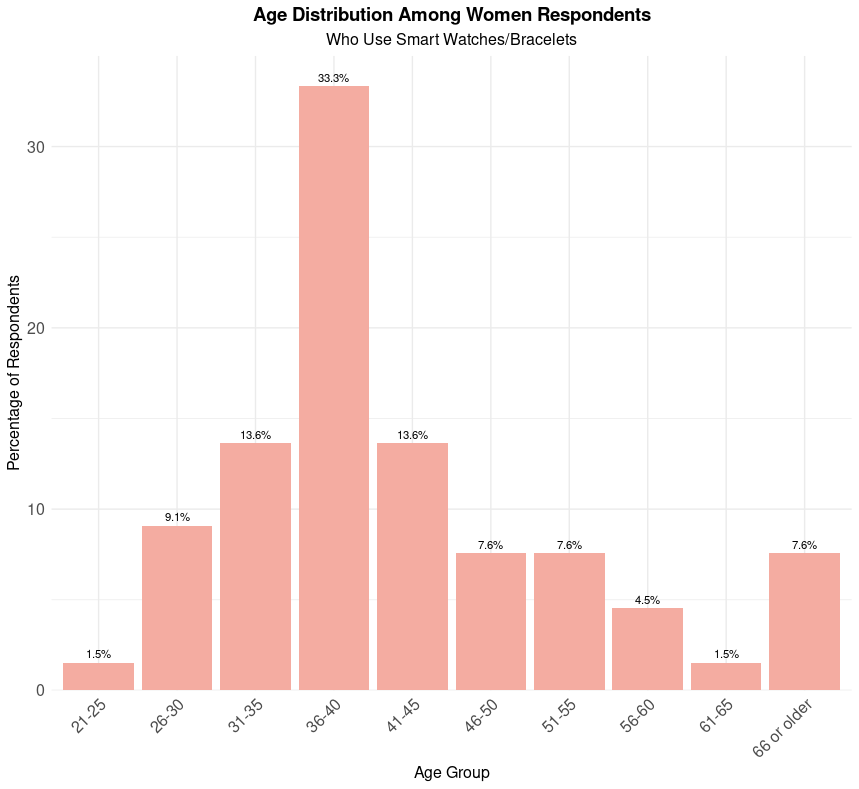
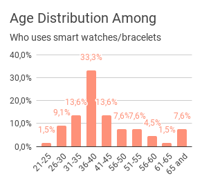
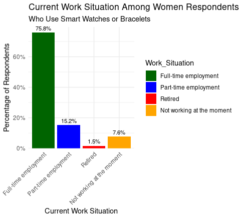
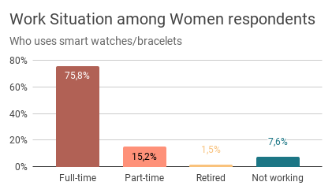
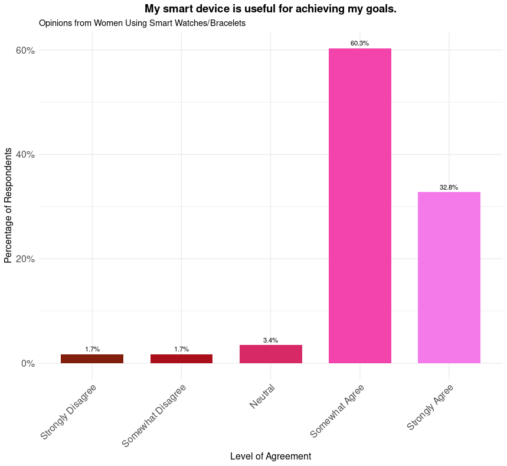
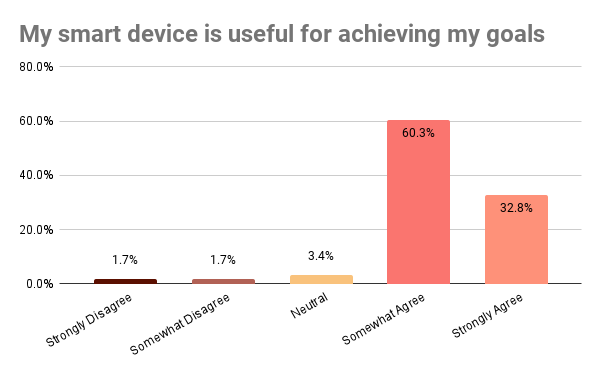
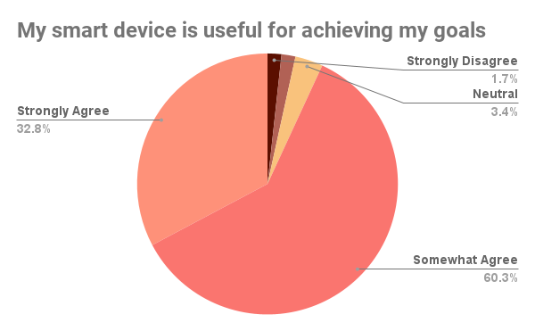

# Chapter 4: Analysis (Survey)

Now that the survey dataset `cleaned_survey.csv` is cleaned and stored in the `Cleaned_Survey` folder, it's time to start the actual data analysis.

## 1) Filtering respondents by gender and device ownership

To focus the analysis on Bellabeat target customer group (100% women who use wearables), the dataset was filtered accordingly. Specifically, only female respondents (`Q19_Sex == 2`) who own smart watches or bracelets (`Q16_Device_Owned == "Smart watches/bracelets (e.g. Polar, FitBit)"`) were included in the analysis.

Sample R code

```r
# To match Bellabeat's target customer base
# Filter to: a) women b) who use "Smart watches/bracelets (e.g. Polar, FitBit)" type of devices
filtered_df <- survey_df %>%
  filter(Q19_Sex == 2, Q16_Device_Owned == 1)


# Check the structure to confirm changes
glimpse(filtered_df) 
# OK: col Q19_Sex contains only "2" (women)
# OK: col Q16_Device_Owned contains only "1" (using smart watches/bracelets)
```

## 2) Analyzing demographics (age and employment status) for women using wearables

### 2-1) Age distribution

R code sample

``` r
# Define age group labels
age_labels <- c(
  "1" = "20 or younger",
  "2" = "21-25",
  "3" = "26-30",
  "4" = "31-35",
  "5" = "36-40",
  "6" = "41-45",
  "7" = "46-50",
  "8" = "51-55",
  "9" = "56-60",
  "10" = "61-65",
  "11" = "66 or older"
)

# Calculate counts and percentages
age_distribution <- filtered_df %>%
  # Remove NA values in Q17_Age
  filter(!is.na(Q17_Age)) %>%
  # Group by age and calculate counts
  group_by(Q17_Age) %>%
  summarise(Count = n()) %>%
  ungroup() %>%
  # Calculate percentage
  mutate(Percentage = (Count / sum(Count)) * 100) %>%
  # Convert Q17_Age to a factor with labels
  mutate(Age_Group = factor(Q17_Age, levels = 1:11, labels = age_labels))

# Verify that percentages sum to 100%
total_percentage <- sum(age_distribution$Percentage)
print(paste("Total Percentage:", round(total_percentage, 2), "%"))

# Create the plot
ggplot(age_distribution, aes(x = Age_Group, y = Percentage)) +
  geom_col(fill = "#F4ACA1") +
  geom_text(aes(label = paste0(round(Percentage, 1), "%")),
            vjust = -0.5, size = 3) +
  labs(
    title = "Age Distribution Among Women Respondents",
    subtitle = "Who Use Smart Watches/Bracelets",
    x = "Age Group",
    y = "Percentage of Respondents"
  ) +
  theme_minimal() +
  theme(
    plot.title = element_text(hjust = 0.5, size = 14, face = "bold"),
    plot.subtitle = element_text(hjust = 0.5, size = 12),
    axis.text.x = element_text(angle = 45, hjust = 1, size = 12),
    axis.text.y = element_text(size = 12),
    axis.title = element_text(size = 12)
  ) +
  scale_y_continuous(expand = expansion(mult = c(0, 0.05)))  # Add some space above bars for labels

```


Output in R:



Output in Google Sheets:




Both plots show that the majority of women using wearables in the survey range between 26 and 45 years old.


### 2-2) Employment status

R code sample

``` r
# Calculate counts and percentages, including NAs labeled as "Others"
work_distribution <- filtered_df %>%
  mutate(Q32_CurrentSituation = if_else(is.na(Q32_CurrentSituation), 5, Q32_CurrentSituation)) %>%
  group_by(Q32_CurrentSituation) %>%
  summarise(Count = n()) %>%
  mutate(Percentage = (Count / sum(Count)) * 100) %>%
  mutate(Work_Situation = factor(Q32_CurrentSituation, levels = 1:5, 
                                 labels = c("Full-time employment", "Part-time employment", "Retired", 
                                            "Not working at the moment", "Others")))

# Plotting with different colors including "Others"
ggplot(work_distribution, aes(x = Work_Situation, y = Percentage, fill = Work_Situation)) +
  geom_col() +
  geom_text(aes(label = paste0(round(Percentage, 1), "%")), 
            vjust = -0.5, size = 3) +
  labs(
    title = "Employment Status Among Women Respondents",
    subtitle = "Who Use Smart Watches or Bracelets",
    x = "Current Work Situation",
    y = "Percentage of Respondents"
  ) +
  scale_fill_manual(values = c(
    "Full-time employment" = "#A78682",   # hex colors from Bellabeat color theme
    "Part-time employment" = "#F4ACA1",
    "Retired" = "#FDDAC5",
    "Not working at the moment" = "#6D8372",
    "Other" = "purple"
  )) +
  theme_minimal() +
  theme(
    axis.text.x = element_text(angle = 45, hjust = 1)
  ) +
  scale_y_continuous(labels = scales::percent_format(scale = 1), 
                     expand = expansion(mult = c(0, 0.05)))

```

Output in R:



Output in Google Sheets:




Both plots show that the majority of women using wearables are in active employment (76% full-time employed and 15% part-time employed.)


## 3) Women's opinions on their device


### 3.1) Top 10 agreements and Top 10 disagrements (among the 42 survey statements)


#### Simplifying/Agregating responses to display three types of opinions (Disagree, Neutral, Agree)

As a reminder, the survey included Likert-scale responses with five levels: Strongly Disagree, Somewhat Disagree, Neutral, Somewhat Agree, and Strongly Agree. 

Given the (2 * 10) statements to display in summary tables, I chose to aggregate these reponses into only three categories (Disagree, Neutral, and Agree) to enhance clarity in the tables. However, for individual visualizations of women's opinions later on in my report, I retained the original five levels for a more nuanced analysis.

#### Transforming data format for analysis and plotting

The data was transformed from a wide format to a long format for compatibility with ggplot2. Additionally, question labels were cleaned by removing prefixes and replacing underscores with spaces for better readability in the plots.

Sample R code:

``` r
# Transform the data to long format for easier analysis and plotting
female_long <- filtered_df %>%
  select(all_of(likert_questions)) %>%  # Select only the Likert question columns
  pivot_longer(cols = everything(), names_to = "Question", values_to = "Response") %>%  # Reshape to long format
  drop_na(Response) %>%  # Remove rows with NA responses
  mutate(
    Question = str_remove(Question, "^Q\\d+_"),       # Remove Q#_ prefix
    Question = str_replace_all(Question, "_", " ")    # Replace underscores with spaces
  )

# Check the structure of the long-format data
str(female_long)

# Clean the 'Response' column by trimming whitespace and ensuring consistent casing
female_long <- female_long %>%
  mutate(
    Response = str_to_title(trimws(Response))  # Remove leading/trailing spaces and convert to Title Case
  )

# Aggregate Likert responses into three categories: Disagree, Neutral, Agree
female_long <- female_long %>%
  mutate(
    Response_Aggregated = case_when(
      Response %in% c("Strongly Disagree", "Somewhat Disagree") ~ "Disagree",
      Response == "Neutral" ~ "Neutral",
      Response %in% c("Somewhat Agree", "Strongly Agree") ~ "Agree"
    )
  )

```


#### Summary statistics

Let's calculate the count and percentage of "Disagree", "Neutral" and "Agree" responses for each survey statement.

Sample R code:

``` r
# Calculate counts and percentages for all aggregated responses per question
  summary_table <- female_long %>%
    group_by(Question, Response_Aggregated) %>%
    summarise(Count = n(), .groups = 'drop') %>%                  # Count occurrences
    group_by(Question) %>%                                        # Group by question to calculate percentages
    mutate(Percentage = Count / sum(Count) * 100) %>%             # Calculate percentage within each question
    ungroup()
```

#### Identifying top responses

Sample R code:

``` r
# Identify top 10 statements where women agree
top_agree <- summary_table %>%
    filter(Response_Aggregated == "Agree") %>%                       # Filter for 'Agree'
    arrange(desc(Percentage)) %>%                                    # Arrange in descending order
    slice_head(n = 10)                                               # Select top 10
  

# Identify top 10 statements where women disagree
  top_disagree <- summary_table %>%
    filter(Response_Aggregated == "Disagree") %>%                    # Filter for 'Disagree'
    arrange(desc(Percentage)) %>%                                    # Arrange in descending order
    slice_head(n = 10)                                               # Select top 10
```


Output in R:

| Question                                            | Response_Aggregated | Count | Percentage |
|-----------------------------------------------------|---------------------|-------|------------|
| Device Useful For My Goals                          | Agree               | 54    | 93.10%     |
| Enjoy Device                                        | Agree               | 53    | 89.80%     |
| Freely Choose Tasks                                 | Agree               | 53    | 89.80%     |
| Understand How Device Works                         | Agree               | 52    | 88.10%     |
| Positive About Device                               | Agree               | 55    | 87.30%     |
| Device Better Than Non-Smart Equivalent             | Agree               | 47    | 81.03%     |
| Me The User In Control                              | Agree               | 46    | 73.02%     |
| Device Dependent On Me                              | Agree               | 42    | 71.19%     |
| Function Aspect Most Important                      | Agree               | 41    | 70.69%     |
| Device Handles Certain Things Better Than I Can     | Agree               | 41    | 69.49%     |


Output in Google Sheets:

| Question                                                                 | Response_Aggregated | Count | Percentage |
|--------------------------------------------------------------------------|---------------------|-------|------------|
| My smart device is useful for achieving my goals.                         | Agree               | 54    | 93%     |
| I enjoy my smart device                                                   | Agree               | 53    | 90%     |
| I am using this smart device to execute task(s) that I have freely chosen | Agree               | 53    | 90%     |
| I understand how this smart device works.                                 | Agree               | 52    | 88%     |
| I’m positive about having this smart device as a part of my daily life    | Agree               | 55    | 87%     |
| My smart device fulfills its purpose better in comparison with a non-smart equivalent. | Agree  | 47    | 81%     |
| It is me, the user, who is in control of stopping tasks/processes with my smart device. | Agree  | 46    | 73%     |
| My smart device is fundamentally dependent on me, the human user          | Agree               | 42    | 71%     |
| Function (getting things done) is the most important aspect of my smart device. | Agree           | 41    | 71%     |
| Certain things are performed better by my smart device than by me.        | Agree               | 41    | 69%     |
| My smart device is pleasurable to look at/feel                            | Agree               | 40    | 68%     |
| Using my smart device saves me time                                       | Agree               | 37    | 65%     |

 

Output in R:

| Question                            | Response_Aggregated | Count | Percentage |
|-------------------------------------|---------------------|-------|------------|
| Feel Victimized                     | Disagree            | 49    | 77.8%      |
| Consider Naming Device              | Disagree            | 45    | 77.6%      |
| Device Helps Me Social Relations    | Disagree            | 43    | 75.4%      |
| Device Forces Process On Me         | Disagree            | 46    | 73.0%      |
| Device Not Helpful                  | Disagree            | 41    | 69.5%      |
| Device Has Own Personality          | Disagree            | 40    | 69.0%      |
| Cannot Use Device To Achieve Goals  | Disagree            | 40    | 68.0%      |
| Price Most Important Factor         | Disagree            | 37    | 65.0%      |
| See Device As Part of Myself        | Disagree            | 37    | 64.0%      |
| Device Supports Me Like Friend      | Disagree            | 35    | 60.0%      |


Output in Google Sheets:

| Question                                            | Response_Aggregated | Count | Percentage |
|-----------------------------------------------------|---------------------|-------|------------|
| I often feel victimized by my smart device          | Disagree            | 49    | 78%        |
| I would consider naming my smart device             | Disagree            | 45    | 78%        |
| My smart device helps me to have better social relationships | Disagree       | 43    | 75%        |
| My smart device forces a certain process on me      | Disagree            | 46    | 73%        |
| My smart device is not really helpful in getting things done | Disagree      | 41    | 69%        |
| My smart device has a “personality” of its own      | Disagree            | 40    | 69%        |
| I cannot really use my smart device to achieve the things I want | Disagree     | 40    | 68%        |
| Price was the most important factor in purchasing this smart device | Disagree   | 37    | 65%        |
| I see my smart device as a part of myself           | Disagree            | 37    | 64%        |
| My smart device supports me like a “friend”         | Disagree            | 35    | 60%        |


## 3.2) Plotting individual response with full Likert nuances

While the three aggregated opinion levels (disagree, neutral, agree) are useful for summary tables in my Google Slides report on women's opinions, I chose to retain the five original Likert levels to gain more nuanced insights and avoid losing any information about women's views on each specific statement regarding their smart devices.

Sample R code:

``` r
# Load the cleaned survey data
csv_file <- here("DATA", "Survey", "Cleaned_Survey", "cleaned_survey.csv")
survey_df <- read_csv(csv_file)

str(survey_df)
glimpse(survey_df)

# Define Likert statements
likert_statements <- c(
  "Q3_Positive_About_Device", "Q3_Feel_Victimized",
  "Q3_Device_Runs_Independently", "Q3_Device_Cannot_Initiate_Actions",
  "Q3_Me_The_User_In_Control", "Q3_Device_Forces_Process_On_Me",
  "Q3_Device_Cannot_Change_Task", "Q3_Device_Has_Own_Intelligence",
  "Q4_Understand_How_Device_Works", "Q4_Not_Ideal_Use",
  "Q4_Device_Active_Participant", "Q4_Device_Dependent_On_Me",
  "Q4_Freely_Choose_Tasks", "Q4_Cannot_Achieve_Things_I_Want",
  "Q4_Device_Handles_Better_Certain_Things", "Q4_Device_Not_Helpful",
  "Q5_Enjoy_Device", "Q5_Negative_Feelings_Towards_Device",
  "Q5_Miss_Device", "Q5_Device_Pleasurable",
  "Q6_Device_Has_Own_Personality", "Q6_Device_Supports_Like_Friend",
  "Q6_Consider_Naming_Device", "Q7_Device_Part_Of_Myself",
  "Q7_Dont_Like_Others_Use_My_Device", "Q7_Feel_Incomplete_Without_Device",
  "Q8_Device_Useful_For_My_Goals", "Q8_Device_Better_Than_NonSmart_Equivalent",
  "Q8_Function_Aspect_Most_Important", "Q9_Device_Important_Part_Lifestyle",
  "Q9_Device_Helps_Me_Larger_Community", "Q9_Device_Helps_Me_Social_Relations",
  "Q10_Saves_Me_Time", "Q10_Saves_Me_Money", "Q10_Price_Most_Important_Factor"
)

[code snippet removed for clarity]

# To match Bellabeat's target customer base
# Filter to only women who use wearables (smart watches/bracelets)
filtered_df <- survey_df %>%
  filter(Q19_Sex == 2, Q16_Device_Owned == 1)

# Convert Likert responses to ordered factors with defined levels
filtered_df <- filtered_df %>%
  mutate(across(all_of(likert_statements), ~ factor(.,
                                                   levels = c("Strongly Disagree", "Somewhat Disagree", "Neutral", "Somewhat Agree", "Strongly Agree"),
                                                   ordered = TRUE)))

# Check the structure to confirm changes
str(filtered_df)

[code snippet removed for clarity]

  # Q3: "My smart device is useful for achieving my goals."
plot_percentage_bar(
  data = filtered_df,
  question_var = Q3_Positive_About_Device,
  question_label = question_labels$Q3_Positive_About_Device,
  colors = likert_colors
)
```
 

Bar chart in R:




Bar chart in Google Sheets:




Since I was plotting women's levels of agreement as percentages, I also created a pie chart in Google Sheets to provide different perspective on the same data:




The same process was applied to each survey statement.

Based on these insights from both the Fitbit and survey datasets, I am now ready to create a Google Slides presentation and provide data-driven recommendations to Bellabeat stakeholders.
  
