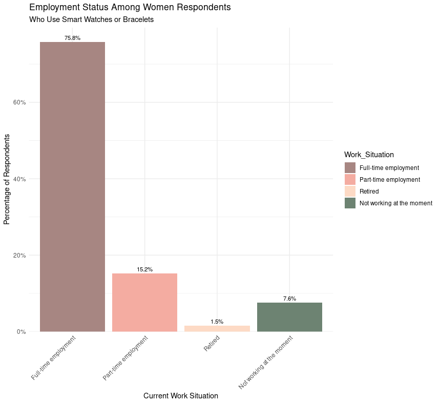

# Chapter 4: Analysis (Survey)

Now that the survey dataset `cleaned_survey.csv` is cleaned and stored in the `Cleaned_Survey` folder, it's time to start the actual data analysis.

## 1) Further data preparation for analysis

### 1.1. Filtering respondents by gender and device ownership

To focus the analysis on Bellabeat's target customer group (i.e. 100% women who use wearables), the dataset was filtered accordingly. Specifically, only female respondents (`Q19_Sex == 2`) who own smart watches or bracelets (`Q16_Device_Owned == "Smart watches/bracelets (e.g. Polar, FitBit)"`) were included in the analysis.

Sample R code

```r
filtered_df <- survey_df %>%
  filter(Q19_Sex == 2, Q16_Device_Owned == "Smart watches/bracelets (e.g. Polar, FitBit)")
```

### 1.2. Refining responses to display three types of opinions (Disagree, Neutral, Agree)

The survey included Likert-scale responses with five levels: Strongly Disagree, Somewhat Disagree, Neutral, Somewhat Agree, and Strongly Agree. 

I chose to aggregate these responses into three categories: Disagree, Neutral, and Agree, for use in summary tables on women's opinions. Given the 20 statements to display, I felt that grouping the levels into three categories would enhance clarity. However, for individual visualizations of women's opinions, I will retain the original five levels.

### 1.3 Transforming data format for analysis and plotting

The data was transformed from a wide format to a long format for easier analysis and visualization using ggplot2. Additionally, question labels were cleaned by removing prefixes and replacing underscores with spaces for better readability in the plots.

Sample R code

``` r
# Transform the data to long format for easier analysis and plotting
female_long <- filtered_df %>%
  select(all_of(likert_questions)) %>%  # Select only the Likert question columns
  pivot_longer(cols = everything(), names_to = "Question", values_to = "Response") %>%  # Reshape to long format
  drop_na(Response) %>%  # Remove rows with NA responses
  mutate(
    Question = str_remove(Question, "^Q\\d+_"),       # Remove Q#_ prefix
    Question = str_replace_all(Question, "_", " ")    # Replace underscores with spaces
  )

# Check the structure of the long-format data
str(female_long)

# Clean the 'Response' column by trimming whitespace and ensuring consistent casing
female_long <- female_long %>%
  mutate(
    Response = str_to_title(trimws(Response))  # Remove leading/trailing spaces and convert to Title Case
  )

# Aggregate Likert responses into three categories: Disagree, Neutral, Agree
female_long <- female_long %>%
  mutate(
    Response_Aggregated = case_when(
      Response %in% c("Strongly Disagree", "Somewhat Disagree") ~ "Disagree",
      Response == "Neutral" ~ "Neutral",
      Response %in% c("Somewhat Agree", "Strongly Agree") ~ "Agree"
    )
  )

```

## 2) Exploratory Data Analysis (EDA)

### 2.1 Demographics

Let's analyze the age distribution and the employment status of the smart device female users who responded to this survey.

- Age


Output in R:


And in Google Sheets:


Both plots show that the majority of women using wearables in the survey range between 26 and 45 years old.


- Employment status

R plot:



And in Google Sheets:


Both plots show that the majority of women using wearables are in active employment (76% full-time employed and 15% part-time employed.)


### 2.2 Summary statistics

Let's calculate the count and percentage of "Disagree", "Neutral" and "Agree" responses for each survey statement.

Sample R code

``` r
# Calculate counts and percentages for all aggregated responses per question
  summary_table <- female_long %>%
    group_by(Question, Response_Aggregated) %>%
    summarise(Count = n(), .groups = 'drop') %>%                  # Count occurrences
    group_by(Question) %>%                                        # Group by question to calculate percentages
    mutate(Percentage = Count / sum(Count) * 100) %>%             # Calculate percentage within each question
    ungroup()
```

### 2.3. Identifying top responses

Let's identify the top 10 statements with the highest percentages of "Agree" and "Disagree" responses provideed targeted insights.

Sample R code

``` r
# Identify top 10 statements where women agree
top_agree <- summary_table %>%
    filter(Response_Aggregated == "Agree") %>%                       # Filter for 'Agree'
    arrange(desc(Percentage)) %>%                                    # Arrange in descending order
    slice_head(n = 10)                                               # Select top 10
  

# Identify top 10 statements where women disagree
  top_disagree <- summary_table %>%
    filter(Response_Aggregated == "Disagree") %>%                    # Filter for 'Disagree'
    arrange(desc(Percentage)) %>%                                    # Arrange in descending order
    slice_head(n = 10)                                               # Select top 10
```


Findings:

- Top 10 statements with highest 'Agree' percentages from women using wearables:
  - Question                    Response_Aggregated Count Percentage
  - <chr>                       <ord>               <int>      <dbl>
  - 1 Device Useful For My Goals  Agree                  54       93.1
  - 2 Enjoy Device                Agree                  53       89.8
  - 3 Freely Choose Tasks         Agree                  53       89.8
  - 4 Understand How Device Works Agree                  52       88.1
  - 5 Positive About Device       Agree                  55       87.3
 

- Top 10 statements with highest 'Disagree' percentages from women using wearables:
  - Question                         Response_Aggregated Count Percentage
  - <chr>                            <ord>               <int>      <dbl>
  - 1 Feel Victimized                  Disagree               49       77.8
  - 2 Consider Naming Device           Disagree               45       77.6
  - 3 Device Helps Me Social Relations Disagree               43       75.4
  - 4 Device Forces Process On Me      Disagree               46       73.0
  - 5 Device Not Helpful               Disagree               41       69.5
 


## 3) Visualizations

While the three aggregated opinion levels (disagree, neutral, agree) are useful for summary tables in my Google Slides report on women's opinions, I chose to retain the five original Likert levels to gain more nuanced insights and avoid losing any information about women's views on each specific statement regarding their smart devices.

### 3.1 Bar charts displaying women's opinions about their smart device

Sample R code

``` r
# Load the cleaned survey data
csv_file <- here("DATA", "Survey", "Cleaned_Survey", "cleaned_survey.csv")
survey_df <- read_csv(csv_file)

str(survey_df)
glimpse(survey_df)

# Define Likert statements
likert_statements <- c(
  "Q3_Positive_About_Device", "Q3_Feel_Victimized",
  "Q3_Device_Runs_Independently", "Q3_Device_Cannot_Initiate_Actions",
  "Q3_Me_The_User_In_Control", "Q3_Device_Forces_Process_On_Me",
  "Q3_Device_Cannot_Change_Task", "Q3_Device_Has_Own_Intelligence",
  "Q4_Understand_How_Device_Works", "Q4_Not_Ideal_Use",
  "Q4_Device_Active_Participant", "Q4_Device_Dependent_On_Me",
  "Q4_Freely_Choose_Tasks", "Q4_Cannot_Achieve_Things_I_Want",
  "Q4_Device_Handles_Better_Certain_Things", "Q4_Device_Not_Helpful",
  "Q5_Enjoy_Device", "Q5_Negative_Feelings_Towards_Device",
  "Q5_Miss_Device", "Q5_Device_Pleasurable",
  "Q6_Device_Has_Own_Personality", "Q6_Device_Supports_Like_Friend",
  "Q6_Consider_Naming_Device", "Q7_Device_Part_Of_Myself",
  "Q7_Dont_Like_Others_Use_My_Device", "Q7_Feel_Incomplete_Without_Device",
  "Q8_Device_Useful_For_My_Goals", "Q8_Device_Better_Than_NonSmart_Equivalent",
  "Q8_Function_Aspect_Most_Important", "Q9_Device_Important_Part_Lifestyle",
  "Q9_Device_Helps_Me_Larger_Community", "Q9_Device_Helps_Me_Social_Relations",
  "Q10_Saves_Me_Time", "Q10_Saves_Me_Money", "Q10_Price_Most_Important_Factor"
)

[code snippet removed for clarity]

# To match Bellabeat's target customer base
# Filter to only women who use wearables (smart watches/bracelets)
filtered_df <- survey_df %>%
  filter(Q19_Sex == 2, Q16_Device_Owned == "Smart watches/bracelets (e.g. Polar, FitBit)")

# Convert Likert responses to ordered factors with defined levels
filtered_df <- filtered_df %>%
  mutate(across(all_of(likert_statements), ~ factor(.,
                                                   levels = c("Strongly Disagree", "Somewhat Disagree", "Neutral", "Somewhat Agree", "Strongly Agree"),
                                                   ordered = TRUE)))

# Check the structure to confirm changes
str(filtered_df)

[code snippet removed for clarity]

  # Q3: "I’m positive about having this smart device as a part of my daily life."
plot_percentage_bar(
  data = filtered_df,
  question_var = Q3_Positive_About_Device,
  question_label = question_labels$Q3_Positive_About_Device,
  colors = likert_colors
)
```
 

R plot:


And in Google Sheets:


  
